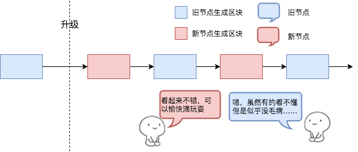
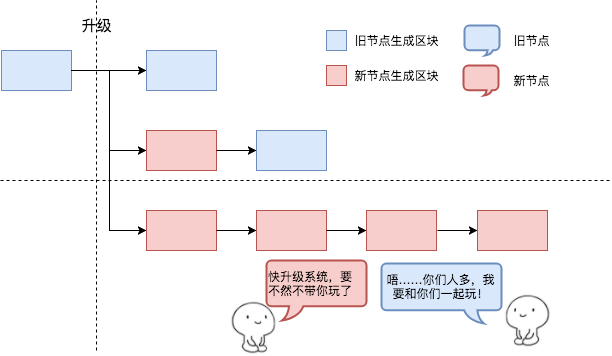
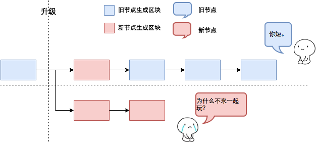
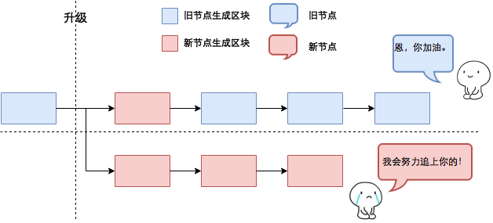
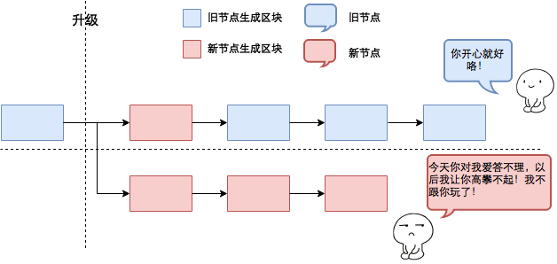
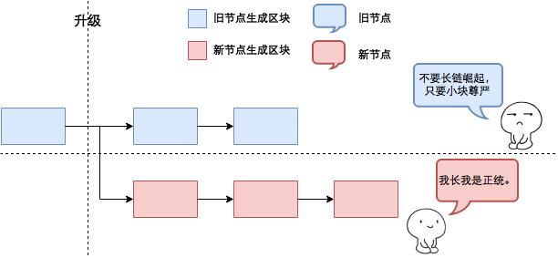

# Bitcoin的扩容与分叉

## 扩容

简单来说，Bitcoin规定每10分钟（左右）挖出一个大小为1MB的区块，每笔交易平均下来是250字节，于是，每块可以放进4000笔交易，除以600，即每秒7笔交易。如此慢的TPS会导致什么——有大量的交易会被存留在交易池中。

那么，如何去解决拥堵的问题呢。我们可以选择提高交易费，但这样并不是长久之计，所以扩容是一个重要的需要解决的问题。

那么，当我们得出了扩容的方案之后，我们又该如何将这个新的服务大规模的服务于公众，毕竟这不是向我们平时接触的软件一样，可以由一个中心化机构对大家进行升级，由此，我们就引入了**分叉**的概念

## 分叉

先说定义，简单地定义的话，就是：

* 软分叉（不分叉）：旧节点接受新区块，新节点也接受旧区块。

* 软分叉：旧节点接受新区块，新节点不接受旧区块。

* 硬分叉：旧节点不接受新区块。

### 软分叉（不分叉）：

**旧节点接受新区块，新节点也接受旧区块**，这个时候会发生的情况如下图所示：

这种情况并不会导致分叉，因为这种升级并没有改变区块的格式。于是双方都可以如同以前一样愉快的在对方的区块上挖矿。这种情况压根就不会分叉，之前的P2SH的升级就是这类。但问题是，在很多地方，人们称这种情况也为“软分叉”，导致了很多人认为软分叉就一定是这种情况，于是，这就与真正的“软分叉”，也就是下述情况混淆起来了。

### 软分叉：

**旧节点接受新区块，新节点不接受旧区块。**

这个时候，可能会出现两种情况。

1. 如果新节点的算力超过50%，那么会发生下图的情况：

这个时候虽然旧节点会在新区快上挖矿，但是由于新节点不会在旧区块上挖矿，然后新节点的算力较大，**那么最终最长的链一定是全部由新区块组成的链**。而且，这条最长链是双方都认为合法的一条（所以图里两个小人在同侧）。而旧节点这个时候，出于自身利益的考虑，也会升级成新节点——这就是软分叉的最好结果。

然而，软分叉并不一定会出现这种结果——如果新节点的算力不够，就会出现下述情况：

2. 如果新节点的的算力不足50%，那么：

在这种情况下，由于新节点不会在旧区块上挖矿，所以即便新节点先挖出了几块矿，但是后面肯定会全都是旧区块。然后，新节点会认为只有新节点的才是合法的，而旧节点虽然认为两条都合法，但是新区块的那条算力不足导致不是最长链，所以它仍旧会选择上面那条。

出现了这种情况，后续有两种可能的发展，要么：

或者：

两者其实没区别，只是一个态度的不同：前者是我们的算力暂时不够但是更多人加入我们之后我们还是要合起来的，后者就是我们算力少我们认了，我们就是要分，合不上也无所谓。

### 硬分叉：

**旧节点不接受新区块**

