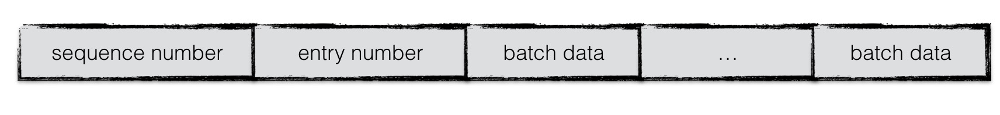
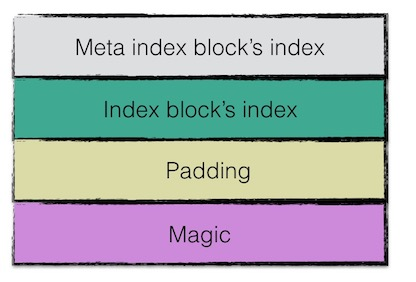
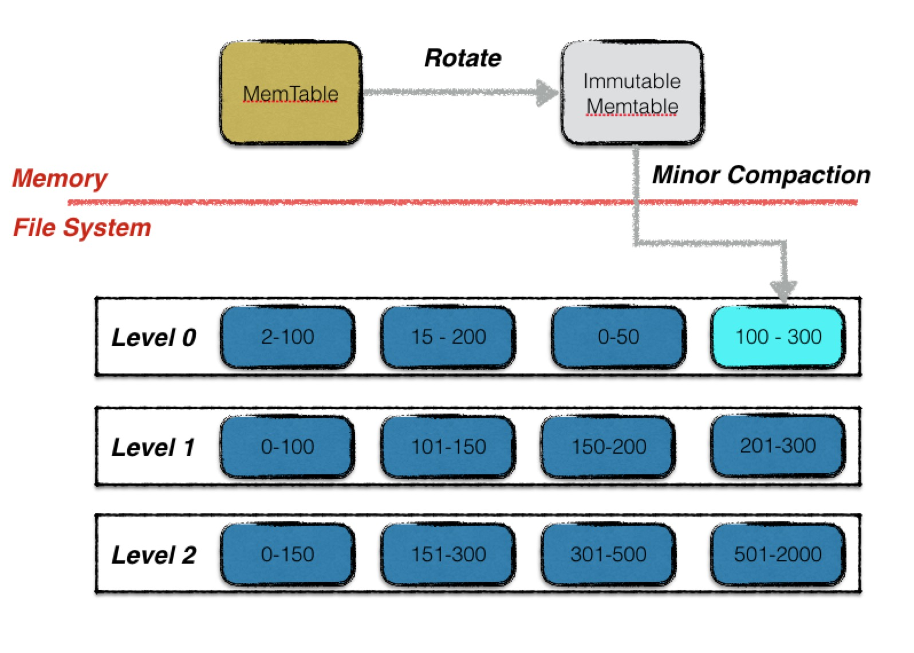

# LevelDB

**一句话说，LevelDB是一款基于LSM树的持久化存储的KV数据库，具有极佳的写功能。**

LSM树的核心思想就是**放弃部分读的性能，换取最大的写入能力**。

LSM树写性能极高的原理，简单地来说就是**尽量减少随机写的次数**。对于每次写入操作，并不是直接将最新的数据驻留在磁盘中，而是将其拆分成**（1）一次日志文件的顺序写（2）一次内存中的数据插入**。LevelDB正是实践了这种思想，将数据首先更新在内存中，当内存中的数据达到一定的阈值，将这部分数据真正刷新到磁盘文件中，因而获得了极高的写性能

## 整体架构


如上图所示，LevelDB共有六个成分组成：

1. Memtable
2. Immutable memtable
3. Log
4. Sstable
5. Manifest
6. Current

## 基本概念

### Memtable

DB数据在内存中的存储方式，写操作会先写入memtable，memtable是处在内存中的，所以效率非常高，但是由于内存容量是有限的，并且价格比较贵，所以我们会在达到阈值（默认为4MB）之后进行一个持久化的过程，变成只读的memtable(**immutable memtable**)，相关内容我们在下文继续介绍。

* **SkipList**

  SkipList本质上也是一种查找结构，用于解决算法中的查找问题，即根据给定的key，快速查到他所在的位置（或者对应的value）。

  SkipList，顾名思义，是一个list，事实上，它是在有序链表的基础上发展起来的。

  我们首先先来看一个有序链表：

  

  在这样的链表中，我们去查询某个数据的话，需要的是从头开始遍历，时间复杂度为O(n)。

  假如我们每相邻两个节点增加一个指针，让指针指向下下个节点，如下图：

  

  那么，在新的一层中，节点数就会下降到原先的一半（即7,19,26），还是从头开始遍历，但是数量减少了。当我们想要查找某个数据时，先沿着新的链表查询，当碰到比待查询数据大的节点时，再回到原来的节点去查询，例如我们想要查找23，查询路径即为红线：

  

  同样的，我们还可以继续再多建一层链表，进一步减少查询的次数。可以想象，当链表足够长的时候，这种多层链表的查找方式能让我们跳过很多下层节点，大大加快查找的速度。

  实际上，按照上面生成链表的方式，上面每一层链表的节点个数，是下面一层的节点个数的一半，这样查找过程就非常类似于一个**二分查找**，使得查找的时间复杂度可以降低到O(log n)。但是，**这种方法在插入数据的时候有很大的问题**。新插入一个节点之后，就会打乱上下相邻两层链表上节点个数严格的2:1的对应关系。如果要维持这种对应关系，就必须把新插入的节点后面的所有节点（也包括新插入的节点）重新进行调整，这会让时间复杂度重新蜕化成O(n)。删除数据也有同样的问题。

  SkipList为了避免这一问题，**它不要求上下相邻两层链表之间的节点个数有严格的对应关系**，而是为每个节点随机出一个层数(level)。比如，一个节点随机出的层数是3，那么就把它链入到第1层到第3层这三层链表中。为了表达清楚，下图展示了如何通过一步步的插入操作从而形成一个SkipList的过程：

  

  * **SkipList和平衡树、哈希表的比较**
    - **SkipList和各种平衡树（如AVL、红黑树等）的元素是有序排列的，而哈希表不是有序的。**因此，在哈希表上只能做单个key的查找，不适宜做范围查找。所谓范围查找，指的是查找那些大小在指定的两个值之间的所有节点。
    - 在做范围查找的时候，平衡树比SkipList操作要复杂。在平衡树上，我们找到指定范围的小值之后，还需要以中序遍历的顺序继续寻找其它不超过大值的节点。如果不对平衡树进行一定的改造，这里的中序遍历并不容易实现。而在SkipList上进行范围查找就非常简单，只需要在找到小值之后，对第1层链表进行若干步的遍历就可以实现。
    - 平衡树的插入和删除操作可能引发子树的调整，逻辑复杂，而SkipList的插入和删除只需要修改相邻节点的指针，操作简单又快速。
    - 从内存占用上来说，SkipList比平衡树更灵活一些。**一般来说，平衡树每个节点包含2个指针（分别指向左右子树），而SkipList每个节点包含的指针数目平均为1/(1-p)，**具体取决于参数p的大小。如果像Redis里的实现一样，取p=1/4，那么平均每个节点包含1.33个指针，比平衡树更有优势。
    - 查找单个key，SkipList和平衡树的时间复杂度都为O(log n)，大体相当；而哈希表在保持较低的哈希值冲突概率的前提下，查找时间复杂度接近O(1)，性能更高一些。所以我们平常使用的各种Map或dictionary结构，大都是基于哈希表实现的。
    - 从算法实现难度上来比较，SkipList比平衡树要简单得多。

### immutable Memtable

memtable的容量到达阈值时，便会转换成一个不可修改的memtable，也称为immutable memtable。这两者的结构定义完全一样，区别只是immutable memtable是只读的。当一个immutable memtable被创建时，leveldb的后台压缩进程便会将利用其中的内容，创建一个sstable，持久化到磁盘文件中。

### Log

前面说过，LevelDB是基于WAL的，所以这里的log就是在写操作过程中率先写入的组件，当以下异常情况发生时，均可以通过日志文件进行恢复：

1. 写log期间进程异常
2. 写log完成，写内存未完成；
3. write动作完成（即log、内存写入都完成）后，进程异常；
4. Immutable Memtable持久化过程中进程异常
5. 其他压缩异常（较为复杂，首先不在这里介绍）

当第一类情况发生时，**数据库重启读取log时，发现异常日志数据，抛弃该条日志数据，即视作这次用户写入失败，保障了数据库的一致性**；

当第二类，第三类，第四类情况发生了，均可以通过redo日志文件中记录的写入操作完成数据库的恢复。

每次日志的写操作都是一次**顺序写**，因此写效率高，整体写入性能较好。

此外，LevelDB的**用户写操作的原子性**同样通过日志来实现。

### sstable

**即持久化到硬盘的数据结构**

除了某些元数据文件，LevelDB的数据主要都是通过sstable来进行存储。

虽然在内存中，所有的数据都是按序排列的，但是当多个Memtable数据持久化到磁盘后，对应的不同的sstable之间是存在**交集**的，在读操作时，需要对所有的sstable文件进行遍历，严重影响了读取效率。因此leveldb后台会“定期“整合这些sstable文件，该过程也称为**compaction**。随着compaction的进行，sstable文件在逻辑上被分成若干层，由内存数据直接dump出来的文件称为level 0层文件，后期整合而成的文件为level i 层文件，这也是leveldb这个名字的由来。

注意，所有的sstable文件本身的内容是不可修改的，这种设计哲学为leveldb带来了许多优势，简化了很多设计。

### manifest

leveldb中有个版本的概念，一个版本中主要记录了每一层中所有文件的元数据，元数据包括（1）文件大小（2）最大key值（3）最小key值。该版本信息十分关键，除了在查找数据时，利用维护的每个文件的最大／小key值来**加快查找**，还在其中维护了一些进行compaction的统计值，来控制compaction的进行。

当每次**compaction完成**（或者换一种更容易理解的说法，当每次sstable文件有新增或者减少），leveldb都会创建一个新的version，创建的规则是:

`versionNew = versionOld + versionEdit`

versionEdit指代的是基于旧版本的基础上，变化的内容（例如新增或删除了某些sstable文件）。

**manifest文件就是用来记录这些versionEdit信息的**。一个versionEdit数据，会被编码成一条记录，写入manifest文件中。例如下图便是一个manifest文件的示意图，其中包含了3条versionEdit记录，每条记录包括（1）新增哪些sst文件（2）删除哪些sst文件（3）当前compaction的下标（4）日志文件编号（5）操作seqNumber等信息。通过这些信息，leveldb便可以在启动时，基于一个空的version，不断增加这些记录，最终得到一个上次运行结束时的版本信息。


### current

这个文件的内容只有一个信息，**就是记载当前的manifest文件名**。

因为每次leveldb启动时，都会创建一个新的Manifest文件。因此数据目录可能会存在多个Manifest文件。Current则用来指出哪个Manifest文件才是我们关心的那个Manifest文件。

## 读写操作

### 写操作


首先我们要确认的是，LevelDB是一个基于**WAL**（**Write-ahead Log**）的存储系统，即先写日志数据，后写用户数据，这样就可以保证用户数据的持久化。在数据库意外宕机时，可以利用WAL恢复到宕机前的状态。

leveldb对外提供的写入接口有：（1）Put（2）Delete两种。这两种本质对应同一种操作，Delete操作同样会被转换成一个value为空的Put操作。

除此以外，leveldb还提供了一个批量处理的工具Batch，用户可以依据Batch来完成批量的数据库更新操作，且这些操作是原子性的。

#### batch结构

无论是Put/Del操作，还是批量操作，底层都会为这些操作创建一个batch实例作为一个数据库操作的最小执行单元。因此首先介绍一下batch的组织结构。


在batch中，每一条数据项都按照上图格式进行编码。每条数据项编码后的第一位是这条数据项的类型（更**新还是删除**），之后是数据项key的长度，数据项key的内容；若该数据项不是删除操作，则再加上value的长度，value的内容。

batch中会维护一个size值，用于表示其中包含的数据量的大小。**该size值为所有数据项key与value长度的累加**，**以及每条数据项额外的8个字节。**这8个字节用于存储一条数据项额外的一些信息。

#### key值编码

当数据项从batch中写入到内存数据库中时，需要对一个key值进行转换，即在leveldb内部，所有数据项的key是经过特殊编码的，这种格式称为internalKey。


internalkey在用户key的基础上，尾部追加了8个字节，用于存储（1）该操作对应的sequence number（2）该操作的类型。

其中，每一个操作都会被赋予一个sequence number。该计时器是在leveldb内部维护，每进行一次操作就做一个累加。**由于在leveldb中，一次更新或者一次删除，采用的是append的方式，并非直接更新原数据。**因此对应同样一个key，会有多个版本的数据记录，而最大的sequence number对应的数据记录就是最新的。

此外，leveldb的快照（snapshot）也是基于这个sequence number实现的，**即每一个sequence number代表着数据库的一个版本。**

#### 合并写

leveldb中，在面对并发写入时，做了一个处理的优化。**在同一个时刻，只允许一个写入操作将内容写入到日志文件以及内存数据库中。**为了在写入进程较多的情况下，减少日志文件的小写入，增加整体的写入性能，leveldb将一些“小写入”合并成一个“大写入”。

流程如下：

**第一个获取到写锁的写操作**

- 第一个写入操作获取到写入锁；
- 在当前写操作的数据量未超过合并上限，且有其他写操作pending的情况下，将其他写操作的内容合并到自身；
- 若本次写操作的数据量超过上限，或者无其他pending的写操作了，将所有内容统一写入日志文件，并写入到内存数据库中；
- 通知每一个被合并的写操作最终的写入结果，释放或移交写锁；

**其他写操作**：

- 等待获取写锁或者被合并；
- 若被合并，判断是否合并成功，若成功，则等待最终写入结果；反之，则表明获取锁的写操作已经oversize了，此时，该操作直接从上个占有锁的写操作中接过写锁进行写入；
- 若未被合并，则继续等待写锁或者等待被合并；


#### 原子性

leveldb的任意一个写操作（无论包含了多少次写），**其原子性都是由日志文件实现的。**一个写操作中所有的内容会以一个日志中的一条记录，作为最小单位写入。

考虑以下两种异常情况：

1. 写日志未开始，或写日志完成一半，进程异常退出；
2. 写日志完成，进程异常退出；

前者中可能存储一个写操作的部分写已经被记载到日志文件中，仍然有部分写未被记录，这种情况下，当数据库重新启动恢复时，读到这条日志记录时，发现数据异常，**直接丢弃或退出，**实现了写入的原子性保障。

后者，写日志已经完成，已经数据未真正持久化，数据库启动恢复时通过redo日志实现数据写入，仍然保障了原子性。

### 读操作

leveldb提供给用户两种进行读取数据的接口：

1. 直接通过`Get`接口读取数据；
2. 首先创建一个snapshot，基于该snapshot调用`Get`接口读取数据；

两者的本质是一样的，**只不过第一种调用方式默认地以当前数据库的状态创建了一个snapshot，并基于此snapshot进行读取。**

读者可能不了解snapshot（快照）到底是什么？**简单地来说，就是数据库在某一个时刻的状态。**基于一个快照进行数据的读取，读到的内容不会因为后续数据的更改而改变。

由于两种方式本质都是基于快照进行读取的，因此在介绍读操作之前，首先介绍快照。

### 快照

快照代表着数据库某一个时刻的状态，在leveldb中，作者巧妙地用一个**整型数来代表一个数据库状态**。

在leveldb中，**用户对同一个key的若干次修改（包括删除）是以维护多条数据项的方式进行存储的**（直至进行compaction时才会合并成同一条记录），每条数据项都会被赋予一个序列号，代表这条数据项的新旧状态。一条数据项的序列号越大，表示其中代表的内容为最新值。

**因此，每一个序列号，其实就代表着leveldb的一个状态**。换句话说，每一个序列号都可以作为一个状态快照。

当用户主动或者被动地创建一个快照时，leveldb会以当前最新的序列号对其赋值。例如图中用户在序列号为98的时刻创建了一个快照，并且基于该快照读取key为“name”的数据时，即便此刻用户将"name"的值修改为"dog"，再删除，用户读取到的内容仍然是“cat”。


所以，利用快照能够保证数据库进行并发的读写操作。

在获取到一个快照之后，leveldb会为本次查询的key构建一个internalKey（格式如上文所述），其中internalKey的seq字段使用的便是快照对应的seq。通过这种方式可以过滤掉**所有seq大于快照号的数据项**。

## 读取


leveldb读取分为三步：

1. 在memory db中查找指定的key，若搜索到符合条件的数据项，结束查找；
2. 在冻结的memory db中查找指定的key，若搜索到符合条件的数据项，结束查找；
3. 按低层至高层的顺序在level i层的sstable文件中查找指定的key，若搜索到符合条件的数据项，结束查找，否则返回Not Found错误，表示数据库中不存在指定的数据；

注意leveldb在每一层sstable中查找数据时，都是按序依次查找sstable的。

0层的文件比较特殊。**由于0层的文件中可能存在key重合的情况，**因此在0层中，文件编号大的sstable优先查找。理由是文件编号较大的sstable中存储的总是最新的数据。

非0层文件，一层中所有文件之间的key不重合，因此leveldb可以借助sstable的元数据（一个文件中最小与最大的key值）进行快速定位，每一层只需要查找一个sstable文件的内容。

### Log

#### 日志结构


为了增加读取效率，日志文件中按照block进行划分，**每个block的大小为32KB**。每个block中包含了若干个完整的chunk。

一条日志记录包含一个或多个chunk。每个chunk包含了一个7字节大小的header，前4字节是该chunk的校验码，紧接的2字节是该chunk数据的长度，以及最后一个字节是该chunk的类型。其中checksum校验的范围包括chunk的类型以及随后的data数据。

chunk共有四种类型：full，first，middle，last。一条日志记录若只包含一个chunk，则该chunk的类型为full。若一条日志记录包含多个chunk，则这些chunk的第一个类型为first, 最后一个类型为last，中间包含大于等于0个middle类型的chunk。

由于一个block的大小为32KB，因此当一条日志文件过大时，会将第一部分数据写在第一个block中，且类型为first，若剩余的数据仍然超过一个block的大小，则第二部分数据写在第二个block中，类型为middle，最后剩余的数据写在最后一个block中，类型为last。

#### 日志内容

日志的内容为**写入的batch编码后的信息**。

具体的格式为：



一条日志记录的内容包含：

- Header
- Data

其中header中有（1）当前db的sequence number（2）本次日志记录中所包含的put/del操作的个数。

紧接着写入所有batch编码后的内容。

#### 日志写


日志写入流程较为简单，在leveldb内部，实现了一个journal的writer。首先调用Next函数获取一个singleWriter，这个singleWriter的作用就是写入**一条journal记录**。

singleWriter开始写入时，标志着第一个chunk开始写入。在写入的过程中，不断判断writer中buffer的大小，若超过32KiB，将chunk开始到现在做为一个完整的chunk，为其计算header之后将整个block写入文件。与此同时reset buffer，开始新的chunk的写入。

若一条journal记录较大，则可能会分成几个chunk存储在若干个block中。

#### 日志读


同样，日志读取也较为简单。为了避免频繁的IO读取，每次从文件中读取数据时，按block（32KiB）进行块读取。

每次读取一条日志记录，reader调用Next函数返回一个singleReader。singleReader每次调用Read函数就返回一个chunk的数据。每次读取一个chunk，都会检查这批数据的校验码、数据类型、数据长度等信息是否正确，若不正确，且用户要求严格的正确性，则返回错误，否则丢弃整个chunk的数据。

循环调用singleReader的read函数，直至读取到一个类型为Last的chunk，表示整条日志记录都读取完毕，返回。

### sstable

#### 物理结构

为了提高整体的读写效率，一个sstable文件按照固定大小进行块划分，默认**每个块的大小为4KiB**。每个Block中，除了存储数据以外，还会存储两个额外的辅助字段：

1. 压缩类型
2. CRC校验码

压缩类型说明了Block中存储的数据是否进行了数据压缩，若是，采用了哪种算法进行压缩。leveldb中默认采用Snappy算法进行压缩。

CRC校验码是循环冗余校验校验码，校验范围包括数据以及压缩类型。


#### 逻辑结构

在逻辑上，根据功能不同，leveldb在逻辑上又将sstable分为：

1. **data block**: 用来存储key value数据对；
2. **filter block**: 用来存储一些过滤器相关的数据（布隆过滤器），但是若用户不指定leveldb使用过滤器，leveldb在该block中不会存储任何内容；
3. **meta Index block**: 用来存储filter block的索引信息（索引信息指在该sstable文件中的偏移量以及数据长度）；
4. **index block**：index block中用来存储每个data block的索引信息；
5. **footer**: 用来存储meta index block及index block的索引信息；


#### data block结构

data block中存储的数据是leveldb中的keyvalue键值对。其中一个data block中的数据部分（不包括压缩类型、CRC校验码）按逻辑又以下图进行划分：


第一部分用来存储keyvalue数据。由于sstable中所有的keyvalue对都是严格按序存储的，用了节省存储空间，leveldb并不会为每一对keyvalue对都存储完整的key值，而是存储与**上一个key非共享的部分**，避免了key重复内容的存储。

每间隔若干个keyvalue对，将为该条记录重新存储一个完整的key。重复该过程（默认间隔值为16），每个重新存储完整key的点称之为Restart point。

每个数据项的格式如下图所示：


一个entry分为5部分内容：

1. 与前一条记录key共享部分的长度；
2. 与前一条记录key不共享部分的长度；
3. value长度；
4. 与前一条记录key非共享的内容；
5. value内容；

例如：

```
restart_interval=2
entry one  : key=deck,value=v1
entry two  : key=dock,value=v2
entry three: key=duck,value=v3
```


#### filter block结构

为了加快sstable中数据查询的效率，在直接查询data block中的内容之前，leveldb首先根据filter block中的过滤数据判断指定的datablock中是否有需要查询的数据，若判断不存在，则无需对这个datablock进行数据查找。

filter block存储的是data block数据的一些过滤信息。这些过滤数据一般指代**布隆过滤器**的数据，用于加快查询的速度。


filter block存储的数据主要可以分为两部分：（1）过滤数据（2）索引数据。

其中索引数据中，`filter i offset`表示第i个filter data在整个filter block中的起始偏移量，`filter offset's offset`表示filter block的索引数据在filter block中的偏移量。

在读取filter block中的内容时，可以首先读出`filter offset's offset`的值，然后依次读取`filter i offset`，根据这些offset分别读出`filter data`。

Base Lg默认值为11，表示每2KB的数据，创建一个新的过滤器来存放过滤数据。

一个sstable只有一个filter block，其内存储了所有block的filter数据. 具体来说，filter_data_k 包含了所有起始位置处于 [base*k, base*(k+1)]范围内的block的key的集合的filter数据，按数据大小而非block切分主要是为了尽量均匀，以应对存在一些block的key很多，另一些block的key很少的情况。

#### meta index block结构

meta index block用来存储filter block在整个sstable中的索引信息。

meta index block只存储一条记录：

该记录的key为："filter."与过滤器名字组成的常量字符串

该记录的value为：filter block在sstable中的索引信息序列化后的内容，索引信息包括：（1）在sstable中的偏移量（2）数据长度。

#### index block结构

与meta index block类似，index block用来存储所有data block的相关索引信息。

indexblock包含若干条记录，每一条记录代表一个data block的索引信息。

一条索引包括以下内容：

1. data block i 中最大的key值；
2. 该data block起始地址在sstable中的偏移量；
3. 该data block的大小；


#### footer结构

footer大小固定，为**48字节**，用来存储meta index block与index block在sstable中的索引信息，另外尾部还会存储一个magic word。



# compaction

Compaction是leveldb最为复杂的过程之一，同样也是leveldb的性能瓶颈之一。其本质是一种内部数据重合整合的机制，同样也是一种平衡读写速率的有效手段，因此在下文中，首先介绍下leveldb中设计compaction的原由，再来介绍下compaction的具体过程。

## Compaction的作用

### 数据持久化

leveldb是典型的LSM树实现，因此需要对内存中的数据进行持久化。一次内存数据的持久化过程，在leveldb中称为***Minor Compaction\***。

一次minor compaction的产出是一个0层的sstable文件，其中包含了所有的内存数据。但是若干个0层文件中是可能存在数据overlap的。

### 提高读写效率

正如前面的文章提到，leveldb是一个写效率十分高的存储引擎，存储的过程非常简单，只需要一次顺序的文件写和一个时间复杂度为O(log n)的内存操作即可。

相比来说，leveldb的读操作就复杂不少。首先一到两次读操作需要进行一个复杂度为O(log n)的查询操作。若没有在内存中命中数据，则需要在按照数据的新旧程度在0层文件中依次进行查找**遍历**。由于0层文件中可能存在overlap，因此在最差情况下，可能需要遍历所有的文件。

假设leveldb中就是以这样的方式进行数据维护，那么随着运行时间的增长，0层的文件个数会越来越多，在最差的情况下，查询一个数据需要遍历**所有的数据文件**，这显然是不可接受的。因此leveldb设计了一个***Major Compaction\***的过程，将0层中的文件合并为若干个没有数据重叠的1层文件。

对于没有数据重叠的文件，一次查找过程就可以进行优化，最多只需要一个文件的遍历即可完成。因此，leveldb设计compaction的目的之一就是为了**提高读取的效率**。

### 平衡读写差异

有了minor compaction和major compaction，所有的数据在后台都会被规定的次序进行整合。但是一次major compaction的过程其本质是一个**多路归并**的过程，既有大量的磁盘读开销，也有大量的磁盘写开销，显然这是一个严重的性能瓶颈。

但是当用户写入的速度始终大于major compaction的速度时，就会导致0层的文件数量还是不断上升，用户的读取效率持续下降。所以leveldb中规定：

- 当0层文件数量超过`SlowdownTrigger`时，写入的速度主要减慢；
- 当0层文件数量超过`PauseTrigger`时，写入暂停，直至Major Compaction完成；

故compaction也可以起到平衡读写差异的作用。

### 整理数据

leveldb的每一条数据项都有一个版本信息，标识着这条数据的新旧程度。这也就意味着同样一个key，在leveldb中可能存在着多条数据项，且每个数据项包含了不同版本的内容。

为了尽量减少数据集所占用的磁盘空间大小，leveldb在major compaction的过程中，对不同版本的数据项进行合并。

### Compaction过程

由上述所示，compaction分为两类：

- **minor compaction**
- **major compaction**

这两类compaction负责在不同的场景下进行不同的数据整理。

#### Minor Compaction

一次minor compaction非常简单，**其本质就是将一个内存数据库中的所有数据持久化到一个磁盘文件中**。



每次minor compaction结束后，都会生成一个新的sstable文件，也意味着**Leveldb的版本状态发生了变化，会进行一个版本的更替**。

值得注意的是，minor compaction是一个时效性要求非常高的过程，要求其在尽可能短的时间内完成，否则就会堵塞正常的写入操作，因此**minor compaction的优先级高于major compaction**。当进行minor compaction的时候有major compaction正在进行，则会首先暂停major compaction。

#### Major Compaction

相比于minor compaction，major compaction就会复杂地多。首先看一下一次major compaction的示意图。


0层中浅蓝色的三个sstable文件，加上1层中的绿色的sstable文件，四个文件进行了合并，输出成两个按序组织的新的1层sstable文件进行替换。

**条件**

那么什么时候，会触发leveldb进行major compaction呢。总结地来说为以下三个条件：

- 当0层文件数超过预定的上限（默认为4个）；
- 当level i层文件的总大小超过(10 ^ i) MB；
- 当某个文件无效读取的次数过多；

*0层文件个数规定*

由于compaction的其中一个目的是为了提高读取的效率，因此leveldb不允许0层存在过多的文件数，一旦超过了上限值，即可进行major compaction。

*非0层文件数据大小限制*

对于level i（i >= 1）的情况来说，一个读取最多只会访问一个sstable文件，因此，本身对于读取效率的影响不会太大。针对于这部分数据发生compaction的条件，从**提升读取效率**转变成了**降低compaction的IO开销**。

假设leveldb的合并策略只有第一条，那么会导致1层文件的个数越来越多或者总的数据量越来越大，而通常一次合并中，**0层文件key的取值范围是很大的**，**导致每一次0层文件与1层文件进行合并时，1层文件输入文件的总数据量非常庞大**。所以不仅需要控制0层文件的个数，同样，每一层文件的总大小同样需要进行控制，使得每次进行compaction时，IO开销尽量保持常量。

故leveldb规定，1层文件总大小上限为10MB，2层为100MB，依次类推，最高层（7层）没有限制。

*文件读取次数过多*

以上两个机制能够保证随着合并的进行，数据是严格下沉的，但是仍然存在一个问题。

> 假设0层文件完成合并之后，1层文件同时达到了数据上限，同时需要进行合并。
>
> 更加糟糕的是，在最差的情况下，0-n层的文件同时达到了合并的条件，每一层都需要进行合并。

其中一种优化机制是：

- source层的文件个数只有一个；
- source层文件与source+1层文件没有重叠；
- source层文件与source+2层的文件重叠部分不超过10个文件；

当满足这几个条件时，可以将souce层的该文件直接移至source+1层。

但是该条件非常苛刻，还是无法解决上述问题。为了避免可能存在这种“巨大”的合并开销，leveldb引入了第三个机制：”错峰合并“。

那么（1）如何找寻这种适合错峰合并的文件（2）以及如果判断哪个时机是适合进行错峰合并的呢？

对于问题（1）Leveldb的作者认为，一个文件一次查询的开销为10ms, **若某个文件的查询次数过多，且查询在该文件中不命中**, 那么这种行为就可以视为无效的查询开销，这种文件就可以进行错峰合并。

对于问题（2），对于一个1MB的文件，对其合并的开销为25ms。因此当一个文件1MB的文件无效查询超过25次时，便可以对其进行合并。

> 对于一个1MB的文件，其合并开销为（1）source层1MB的文件读取，（2）source+1层 10-12MB的文件读取（3）source+1层10-12MB的文件写入。
>
> 总结25MB的文件IO开销，除以100MB／s的文件IO速度，估计开销为25ms。

**采样探测**

在每个sstable文件的元数据中，还有一个额外的字段`seekLeft`，默认为文件的大小除以16KB。

leveldb在正常的数据访问时，会顺带进行采样探测。正常的数据访问包括（1）用户直接调用Get接口（2）用户使用迭代器进行访问。

采样的规则：

记录本次访问的第一个sstable文件。若在该文件中访问命中，则不做任何处理；若在该文件中访问不命中，则对 该文件的`seekLeft`标志做减一操作。

知道某一个文件的`seekLeft`标志减少到0时，触发对该文件的错峰合并。

故以上三种机制可以保障每次进行compaction的时候，总体开销不会呈现上升趋势。

#### 过程

整个compaction可以简单地分为以下几步：

1. 寻找合适的输入文件；
2. 根据key重叠情况扩大输入文件集合；
3. 多路合并；
4. 积分计算；

**寻找输入文件**：

不同情况下发起的合并动作，其初始的输入文件不同。

对于*level 0层文件数过多引发的合并场景或由于level i层文件总量过大的合并场景*，采用轮转的方法选择起始输入文件，记录了上一次该层合并的文件的最大key，下一次则选择在此key之后的首个文件。

对于*错峰合并*，起始输入文件则为该查询次数过多的文件。

**扩大输入文件集合**

该过程如下：

1. 红星标注的为起始输入文件；
2. 在level i层中，查找与起始输入文件有key重叠的文件，如图中红线所标注，最终构成level i层的输入文件；
3. 利用level i层的输入文件，在level i+1层找寻有key重叠的文件，结果为绿线标注的文件，构成level i，i+1层的输入文件；
4. 最后利用两层的输入文件，在不扩大level i+1输入文件的前提下，查找level i层的有key重叠的文件，结果为蓝线标准的文件，构成最终的输入文件；


**多路合并**：

多路合并的过程比较简单，即将level i层的文件，与level i+1层的文件中的数据项，按序整理之后，输出到level i+1层的若干个新文件中，即合并完成。


注意在整理的过程中，需要将冗余的数据进行清理，即同一条数据的多个版本信息，只保留最新的那一份。

但是要注意，某些仍然在使用的旧版本的数据，在此时不能立刻删除，而得等到用户使用结束，释放句柄后，根据引用计数来进行清除。

**积分计算**

每一次compaction都会消除若干source层的旧文件，新增source+1层的新文件，因此触发进行合并的条件状态可能也发生了变化。故在leveldb中，使用了计分牌来维护每一层文件的文件个数及数据总量信息，来**挑选出下一个需要进行合并的层数**。

计分的规则很简单：

- 对于0层文件，该层的分数为文件总数／4；
- 对于非0层文件，该层的分数为文件数据总量／数据总量上限；

将得分最高的层数记录，若该得分超过1，则为下一次进行合并的层数；

#### 用户行为

由于leveldb内部进行compaction时有trivial move优化，且根据内部的文件格式组织，用户在使用leveldb时，可以尽量将大批量需要写入的数据进行预排序，利用空间局部性，尽量减少多路合并的IO开销。

