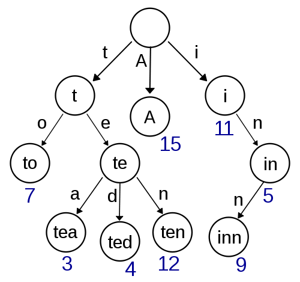
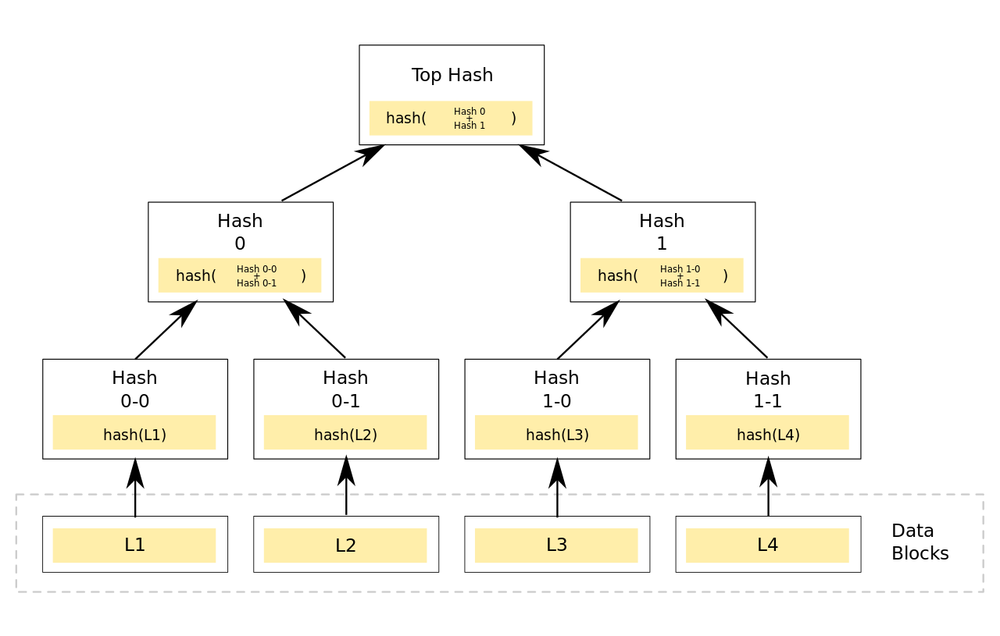
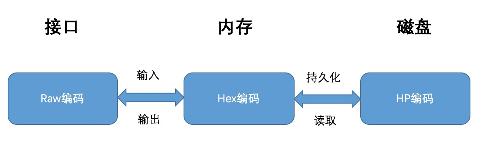

# Merkle Patricia Tree

Merkle Patricia Tree（简称MPT），提供了一个基于密码学的，自校验防篡改的数据结构，用来存储键值对关系。MPT是确定的。确定性是指同样内容的键值，将被保证找到同样的结果，有同样的根哈希。关于效率方面，对树的插入，查找，删除的时间复杂度控制在`O(log(n))`。相较于红黑树来说，MPT更好理解和编码实现。

顾名思义，MPT是由Merkle Tree和Patricia Trie组合而成，融合了这两种数据结构的优点，是Ethereum中用来管理账户数据，生成交易集合哈希的重要数据结构。

要讲MPT，逃不开的就是Ethereum，我们知道Ethereum中的区块头部包含了一个区块头，一个交易的列表和一个uncle区块的列表，在区块头部包括了交易的hash树根，用来校验交易的列表。在p2p网络上传输的交易是一个简单的列表，它们被组装成一个叫做trie树的特殊数据结构，来计算根hash。

值得注意的是，除了校验区块外，这个数据结构并不是必须的，一旦区块被验证正确，那么它在技术上是可以忽略的。但是，这意味着交易列表在本地以trie树的形式存储，发送给客户端的时候序列化成列表。客户端接收到交易列表后重新构建交易列表trie树来验证根hash。Ethereum运用RLP对trie树中所有的条目进行编码。

## 1. 前言

### 1.1 Trie

前缀树。下图就是一个前缀树的例子：



我们可以看到Trie中所有的叶子节点就是我们所要插入的值，这样的数据结构有什么好处呢？我们可以得到一个结构，它之中所有的相似的值都会离得非常近，这样对于我们的查找会非常有帮助。

#### 优点：

1. 相比于Hash Table，使用Trie来进行查询拥有共同前缀key的数据时十分高效
2. 相比于Hash Table，使用Trie进行数据的组织不存在哈希冲突的问题

#### 缺点：

1. 直接查找效率低下

   Trie的查找效率是O(m)，m为所查找节点的key长度，而哈希表的查找效率为O(1)。且一次查找会有m次IO开销，相比于直接查找，无论是速率、还是对磁盘的压力，性能表现都不理想。

2. 可能会造成空间浪费

   当存在一个节点，其key值内容很长（如一串很长的字符串），当树中没有与它有相同前缀的分支时，为了存储该节点，需要创建许多非叶子节点来构建根节点到该节点间的路径，造成了存储空间的浪费。

### 1.2 Radix Tree / Patricia Trie

基数树。为什么要介绍这个数据结构呢？假设我们要存储的值可能和别的值完全不相似，那么这棵树的高度就可能是这个单词的长度，这样就会导致树高过大，造成不必要的资源损失。于是，我们有了下图这样的数据结构：


我们可以看到，基数树和前缀树的区别就在于，基数树会将单词压缩，以减少节点数量。

### 1.3 Merkle Tree

Radix Tree的节点关系，一般是使用比如C语言的32位或64位的内存地址指针来串联起来的。但在Ethereum中为了实现**数据的防篡改及校验**，我们引入了Merkle Tree，使用节点的哈希值来建立节点关系。

那么，什么是Merkle Tree呢？一言以概之：

**非叶子节点的value根据其孩子节点的信息，然后按照Hash算法计算而得出的**

这就是Merkle Tree最重要的特性。如下图：



从上图我们可以清晰地看到**非叶子节点的value根据其孩子节点的信息，然后按照Hash算法计算而得出的**这一特性。我们自底向上构建，首先将L1-L4四个单元数据哈希化，然后将哈希值存储至相应的叶子节点。这些节点是Hash0-0, Hash0-1, Hash1-0, Hash1-1。然后将相邻两个节点的哈希值合并成一个字符串，然后计算这个字符串的哈希，得到的就是这两个节点的父节点的哈希值。

**经过上面的计算，我们发现计算代表整棵树的哈希需要经过7次计算，若采用将这四个叶子节点拼接成一个字符串进行计算，仅仅只需要一次哈希就可以实现，那么为什么要采用这种看似奇怪的方式呢？**

#### 优点：

1. 快速重哈希

   Merkle Tree的特点之一就是当树节点内容发生变化时，能够在前一次哈希计算的基础上，仅仅将被修改的树节点进行哈希重计算，便能得到一个新的根哈希用来代表整棵树的状态。

2. 轻节点扩展

   采用Merkle Tree，可以在公链环境下扩展一种“轻节点”。轻节点的特点是对于每个区块，仅仅需要存储约80个字节大小的区块头数据，而不存储交易列表，回执列表等数据。然而通过轻节点，可以实现在 **非信任的公链环境中**验证某一笔交易是否被收录在区块链账本的功能。这使得像比特币，以太坊这样的区块链能够运行在个人PC，智能手机等拥有小存储容量的终端上。

#### 缺点：

1. 存储空间开销大

## 2. MPT详述：

### 2.1 节点类型

首先我们明确，在MPT中包含四种类型的节点：

- 空节点
- 叶子节点
- 扩展节点
- 分支节点

1. **空节点：**

   在代码中表示的就是空串

2. **叶子节点：**

   代码结构：

   ```go
   type shortNode struct {
   		Key   []byte
   		Val   node
   		flags nodeFlag
   }
   ```

   表示为[key,value]的一个list，其中key是key的一种特殊十六进制编码，下文我们会详细介绍，这里就当做是一种编码就行了，value是value的RLP编码。

3. **扩展节点：**

   代码结构：

   ```go
   type shortNode struct {
   		Key   []byte
   		Val   node
   		flags nodeFlag
   }
   ```

   也是[key，value]的list，其中Key是MPT树实现树高压缩的关键！

   当MPT试图插入一个节点，插入过程中发现目前没有与该节点Key拥有相同前缀的路径。此时MPT把***剩余的Key***存储在叶子／扩展节点的Key字段中，充当一个”Shortcut“。

   而Val字段用来存储叶子／扩展节点的内容，对于叶子节点来说，该字段存储的是一个数据项的内容；而对于扩展节点来说，该字段可以是以下两种内容：

   1. Val字段存储的是其孩子节点在数据库中存储的索引值（其实该索引值也是孩子节点的哈希值）；
   2. Val字段存储的是其孩子节点的引用；

   > 为什么设计在扩展节点的Val字段有可能存储一串哈希值作为孩子节点的索引呢？
   >
   > 在Ethereum中，该哈希代表着另外一个节点在数据库中索引，即根据这个哈希值作为数据库中的索引，可以从数据库中读取出另外一个节点的内容。
   >
   > 这种设计的目的是：
   >
   > （1）当整棵树被持久化到数据库中时，保持节点间的关联关系；
   >
   > （2）从数据库中读取节点时，尽量避免不必要的IO开销；
   >
   > 在内存中，父节点与子节点之间关联关系可以通过引用、指针等编程手段实现，但是当树节点持久化到数据库时，**父节点中会存储一个子节点在数据库中的索引值**，以此保持关联关系。
   >
   > 同样，从数据库中读取节点时，本着最小IO开销的原则，仅需要读取那些需要用到的节点数据即可，因此若目前该节点已经包含所需要查找的信息时，便无须将其子节点再读取出来；反之，则根据子节点的哈希索引递归读取子节点，直至读取到所需要的信息。

   由于叶子／扩展节点共享一套定义，那么怎么来区分Val字段存储的到底是一个数据项的内容，还是一串哈希索引呢？在以太坊中，通过在Key中加入特殊的标志来区分两种类型的节点。

4. **分支节点：**

   分支节点用来表示MPT树中所有拥有超过1个孩子节点以上的非叶子节点。

   因为MPT中的key被编码成一种特殊的16进制的表示，再加上最后的value，所以分支节点是一个长度为17的list，前16个元素对应着key中的16个可能的十六进制字符，如果有一个[key,value]对在这个分支节点终止，最后一个元素代表一个值，即分支节点既可以搜索路径的终止也可以是路径的中间节点。

   其数据结构为：

   ```go
   type fullNode struct {
   		Children [17]node // Actual trie node data to encode/decode (needs custom encoder)
   		flags    nodeFlag
   }
   
   // nodeFlag contains caching-related metadata about a node.
   type nodeFlag struct {
   	hash  hashNode // cached hash of the node (may be nil)
   	gen   uint16   // cache generation counter
   	dirty bool     // whether the node has changes that must be written to the database
   }
   ```

   与Trie相同，MPT同样是把key-value数据项的key编码在树的路径中，但是key的每一个字节值的范围太大（[0-127]），因此在Ethereum中，在进行有关树的操作之前，首先会进行一个key编码的转换（后文会详述），将一个字节的高低四位内容分拆成两个字节存储。通过编码转换，key'的每一位的值范围都在[0, 15]内。**因此，一个分支节点的孩子至多只有16个。**Ethereum通过这种方式，**减小了每个分支节点的容量，但是在一定程度上增加了树高。**

   分支节点的孩子列表中，最后一个元素是用来存储自身的内容。

   此外，每个分支节点会有一个附带的字段`nodeFlag`，记录了一些辅助数据：

   * 节点哈希：若该字段不为空，则当该节点需要进行哈希计算时，可以跳过计算过程而直接使用上次计算的结果（当节点变脏时，该字段被置空）；

   - 脏标志：当一个节点被修改时，该标志位被置为1；
   - 诞生标志：当该节点第一次被载入内存中（或被修改时），会被赋予一个计数值作为诞生标志，该标志会被作为节点驱除的依据，清除内存中“太老”的未被修改的节点，防止占用的内存空间过多；

### 2.2 key的编码

在Ethereum中，MPT的key值共有三种不同的编码方式，以满足不同场景的不同需求，三种编码方式分别为：

1. Raw编码（原生的字符）
2. Hex编码（扩展的16进制编码）
3. Hex-Prefix编码（16进制前缀编码）

#### Raw编码

Raw编码就是原生的key值，不做任何改变。这种编码方式的key，是MPT对外提供接口的默认编码方式。

> 例如一条key为“cat”，value为“dog”的数据项，其Raw编码就是['c', 'a', 't']，换成ASCII表示方式就是[63, 61, 74]

#### Hex编码

将原key的高低四位分拆成两个字节进行存储，这就是Hex编码

从Raw编码向Hex编码的转换规则是：

- 将Raw编码的每个字符，根据高4位低4位拆成两个字节；
- 若该Key对应的节点存储的是真实的数据项内容（即该节点是叶子节点），则在末位添加一个ASCII值为16的字符作为终止标志符；
- 若该key对应的节点存储的是另外一个节点的哈希索引（即该节点是扩展节点），则不加任何字符；

> key为“cat”, value为“dog”的数据项，其Hex编码为[3, 15, 3, 13, 4, 10, 16]

**Hex编码用于对内存中MPT树节点key进行编码**

#### Hex-Prefix编码

在介绍叶子／扩展节点时，我们介绍了这两种节点定义是共享的，即便持久化到数据库中，存储的方式也是一致的。那么当节点加载到内存是，同样需要通过一种额外的机制来区分节点的类型。于是以太坊就提出了一种***HP编码**对存储在数据库中的叶子／扩展节点的key进行编码区分。在将这两类节点持久化到数据库之前，首先会对该节点的key做编码方式的转换，即从Hex编码转换成HP编码*。

HP编码的规则如下：

- 若原key的末尾字节的值为16（即该节点是叶子节点），去掉该字节；
- 在key之前增加一个半字节，其中最低位用来编码原本key长度的奇偶信息，key长度为奇数，则该位为1；低2位中编码一个特殊的终止标记符，若该节点为叶子节点，则该位为1；
- 若原本key的长度为奇数，则在key之前再增加一个值为0x0的**半字节**；
- 将原本key的内容作压缩，即将两个字符以高4位低4位进行组合，存储在一个字节中（Hex扩展的逆过程）；

> 若Hex编码为[3, 15, 3, 13, 4, 10, 16]，则HP编码的值为[32, 63, 61, 74]

**HP编码用于对数据库中的树节点key进行编码**

#### 转换关系



以上三种编码方式的转换关系为：

- Raw编码：原生的key编码，是MPT对外提供接口中使用的编码方式，当数据项被插入到树中时，Raw编码被转换成Hex编码；
- Hex编码：16进制扩展编码，用于对内存中树节点key进行编码，当树节点被持久化到数据库时，Hex编码被转换成HP编码；
- HP编码：16进制前缀编码，用于对数据库中树节点key进行编码，当树节点被加载到内存时，HP编码被转换成Hex编码；

#### 