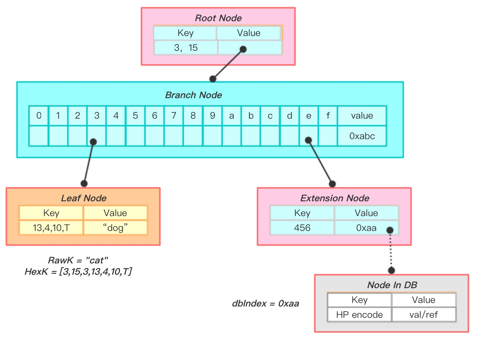
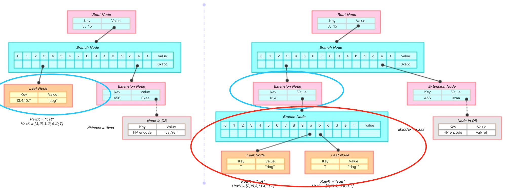
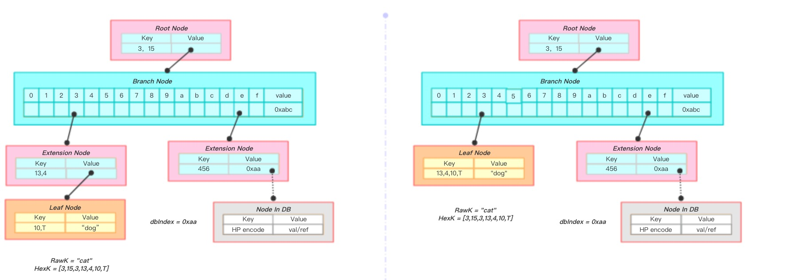
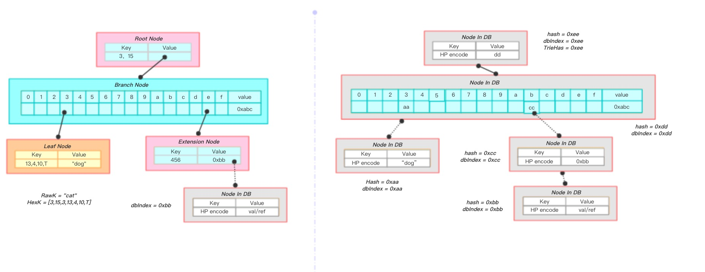
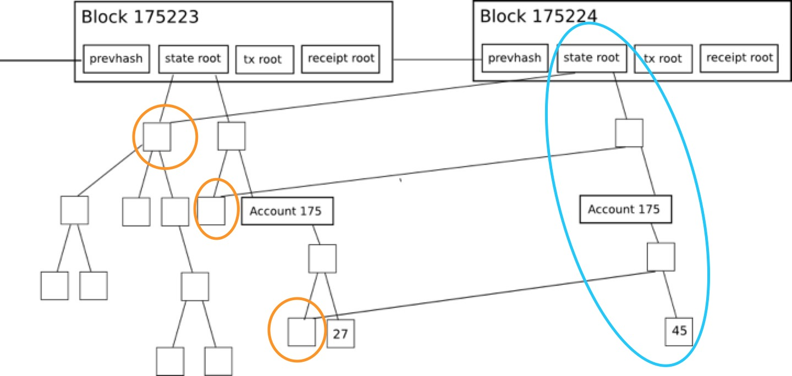
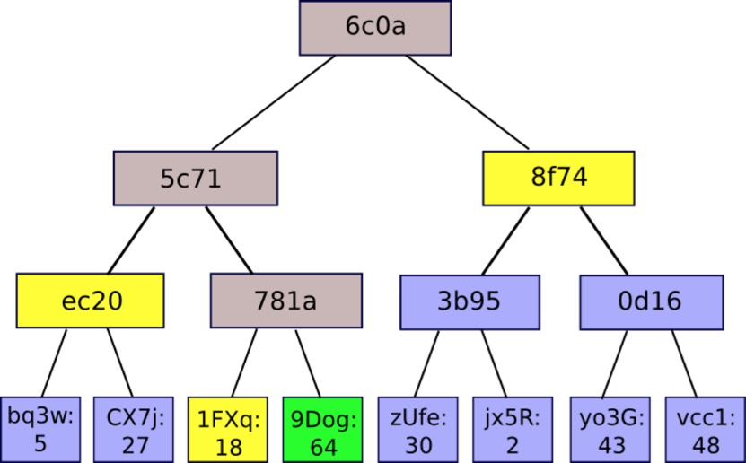

# Merkle Patricia Tree

Merkle Patricia Tree（简称MPT），提供了一个基于密码学的，自校验防篡改的数据结构，用来存储键值对关系。MPT是确定的。确定性是指同样内容的键值，将被保证找到同样的结果，有同样的根哈希。关于效率方面，对树的插入，查找，删除的时间复杂度控制在`O(log(n))`。相较于红黑树来说，MPT更好理解和编码实现。

顾名思义，MPT是由Merkle Tree和Patricia Trie组合而成，融合了这两种数据结构的优点，是Ethereum中用来管理账户数据，生成交易集合哈希的重要数据结构。

要讲MPT，逃不开的就是Ethereum，我们知道Ethereum中的区块头部包含了一个区块头，一个交易的列表和一个uncle区块的列表，在区块头部包括了交易的hash树根，用来校验交易的列表。在p2p网络上传输的交易是一个简单的列表，它们被组装成一个叫做trie树的特殊数据结构，来计算根hash。

值得注意的是，除了校验区块外，这个数据结构并不是必须的，一旦区块被验证正确，那么它在技术上是可以忽略的。但是，这意味着交易列表在本地以trie树的形式存储，发送给客户端的时候序列化成列表。客户端接收到交易列表后重新构建交易列表trie树来验证根hash。Ethereum运用RLP对trie树中所有的条目进行编码。

## 1. 前言

### 1.1 Trie

前缀树。下图就是一个前缀树的例子：


我们可以看到Trie中所有的叶子节点就是我们所要插入的值，这样的数据结构有什么好处呢？我们可以得到一个结构，它之中所有的相似的值都会离得非常近，这样对于我们的查找会非常有帮助。

#### 优点：

1. 相比于Hash Table，使用Trie来进行查询拥有共同前缀key的数据时十分高效
2. 相比于Hash Table，使用Trie进行数据的组织不存在哈希冲突的问题

#### 缺点：

1. 直接查找效率低下

   Trie的查找效率是O(m)，m为所查找节点的key长度，而哈希表的查找效率为O(1)。且一次查找会有m次IO开销，相比于直接查找，无论是速率、还是对磁盘的压力，性能表现都不理想。

2. 可能会造成空间浪费

   当存在一个节点，其key值内容很长（如一串很长的字符串），当树中没有与它有相同前缀的分支时，为了存储该节点，需要创建许多非叶子节点来构建根节点到该节点间的路径，造成了存储空间的浪费。

### 1.2 Radix Tree / Patricia Trie

基数树。为什么要介绍这个数据结构呢？假设我们要存储的值可能和别的值完全不相似，那么这棵树的高度就可能是这个单词的长度，这样就会导致树高过大，造成不必要的资源损失。于是，我们有了下图这样的数据结构：


我们可以看到，基数树和前缀树的区别就在于，基数树会将单词压缩，以减少节点数量。

### 1.3 Merkle Tree

Radix Tree的节点关系，一般是使用比如C语言的32位或64位的内存地址指针来串联起来的。但在Ethereum中为了实现**数据的防篡改及校验**，我们引入了Merkle Tree，使用节点的哈希值来建立节点关系。

那么，什么是Merkle Tree呢？一言以概之：

**非叶子节点的value根据其孩子节点的信息，然后按照Hash算法计算而得出的**

这就是Merkle Tree最重要的特性。如下图：


从上图我们可以清晰地看到**非叶子节点的value根据其孩子节点的信息，然后按照Hash算法计算而得出的**这一特性。我们自底向上构建，首先将L1-L4四个单元数据哈希化，然后将哈希值存储至相应的叶子节点。这些节点是Hash0-0, Hash0-1, Hash1-0, Hash1-1。然后将相邻两个节点的哈希值合并成一个字符串，然后计算这个字符串的哈希，得到的就是这两个节点的父节点的哈希值。

**经过上面的计算，我们发现计算代表整棵树的哈希需要经过7次计算，若采用将这四个叶子节点拼接成一个字符串进行计算，仅仅只需要一次哈希就可以实现，那么为什么要采用这种看似奇怪的方式呢？**

我们思考一下这样的情况，由于在区块链P2P网络中，如果需要传输的数据非常大，我们就需要从多个机器上去下载数据，并且由于网络或者硬件原因，下载可能是不稳定的。那么我们的解决方式就是将大区块分割为多个小数据块，此时如果我们下载的数据有问题，就只需要去重新下载有问题的那个数据块即可。但是如果我们将多个叶子节点拼接起来去hash，那么我们如何判断出出问题的是哪个区块呢，因此，我们选择一个树形结构，这样我们就可以通过判断根节点的孩子节点的hash是否正确来最终确定一个错误的数据块。这也就是为什么我们要按照上述方式进行处理。

如果此时我们需要验证L2这个数据块的可靠性，在Merkle Tree的结构下，我们只需要拿到Hash0-0，Hash1加上本地存储的Top Hash，这样我们就不需要下载全部Hash，只需要一段Merkle路径即可，传输的数据量从n变成了log2n

#### 优点：

1. 快速重哈希

   Merkle Tree的特点之一就是当树节点内容发生变化时，能够在前一次哈希计算的基础上，仅仅将被修改的树节点进行哈希重计算，便能得到一个新的根哈希用来代表整棵树的状态。

2. 轻节点扩展

   采用Merkle Tree，可以在公链环境下扩展一种“轻节点”。轻节点的特点是对于每个区块，仅仅需要存储约80个字节大小的区块头数据，而不存储交易列表，回执列表等数据。然而通过轻节点，可以实现在 **非信任的公链环境中**验证某一笔交易是否被收录在区块链账本的功能。这使得像比特币，以太坊这样的区块链能够运行在个人PC，智能手机等拥有小存储容量的终端上。

#### 缺点：

1. 存储空间开销大

## 2. MPT详述：

### 2.1 节点类型

首先我们明确，在MPT中包含四种类型的节点：

- 空节点
- 叶子节点
- 扩展节点
- 分支节点

1. **空节点：**

   在代码中表示的就是空串

2. **叶子节点：**

   代码结构：

   ```go
   type shortNode struct {
   		Key   []byte
   		Val   node
   		flags nodeFlag
   }
   ```

   表示为[key,value]的一个list，其中key是key的一种特殊十六进制编码，下文我们会详细介绍，这里就当做是一种编码就行了，value是value的RLP编码。

3. **扩展节点：**

   代码结构：

   ```go
   type shortNode struct {
   		Key   []byte
   		Val   node
   		flags nodeFlag
   }
   ```

   也是[key，value]的list，其中Key是MPT树实现树高压缩的关键！

   当MPT试图插入一个节点，插入过程中发现目前没有与该节点Key拥有相同前缀的路径。此时MPT把***剩余的Key***存储在叶子／扩展节点的Key字段中，充当一个”Shortcut“。

   而Val字段用来存储叶子／扩展节点的内容，对于叶子节点来说，该字段存储的是一个数据项的内容；而对于扩展节点来说，该字段可以是以下两种内容：

   1. Val字段存储的是其孩子节点在数据库中存储的索引值（其实该索引值也是孩子节点的哈希值）；
   2. Val字段存储的是其孩子节点的引用；

   > 为什么设计在扩展节点的Val字段有可能存储一串哈希值作为孩子节点的索引呢？
   >
   > 在Ethereum中，该哈希代表着另外一个节点在数据库中索引，即根据这个哈希值作为数据库中的索引，可以从数据库中读取出另外一个节点的内容。
   >
   > 这种设计的目的是：
   >
   > （1）当整棵树被持久化到数据库中时，保持节点间的关联关系；
   >
   > （2）从数据库中读取节点时，尽量避免不必要的IO开销；
   >
   > 在内存中，父节点与子节点之间关联关系可以通过引用、指针等编程手段实现，但是当树节点持久化到数据库时，**父节点中会存储一个子节点在数据库中的索引值**，以此保持关联关系。
   >
   > 同样，从数据库中读取节点时，本着最小IO开销的原则，仅需要读取那些需要用到的节点数据即可，因此若目前该节点已经包含所需要查找的信息时，便无须将其子节点再读取出来；反之，则根据子节点的哈希索引递归读取子节点，直至读取到所需要的信息。

   由于叶子/扩展节点共享一套定义，那么怎么来区分Val字段存储的到底是一个数据项的内容，还是一串哈希索引呢？在以太坊中，通过在Key中加入特殊的标志来区分两种类型的节点。

4. **分支节点：**

   分支节点用来表示MPT树中所有拥有超过1个孩子节点以上的非叶子节点。

   因为MPT中的key被编码成一种特殊的16进制的表示，再加上最后的value，所以分支节点是一个长度为17的list，前16个元素对应着key中的16个可能的十六进制字符，如果有一个[key,value]对在这个分支节点终止，最后一个元素代表一个值，即分支节点既可以搜索路径的终止也可以是路径的中间节点。

   其数据结构为：

   ```go
   type fullNode struct {
   		Children [17]node // Actual trie node data to encode/decode (needs custom encoder)
   		flags    nodeFlag
   }
   
   // nodeFlag contains caching-related metadata about a node.
   type nodeFlag struct {
   	hash  hashNode // cached hash of the node (may be nil)
   	gen   uint16   // cache generation counter
   	dirty bool     // whether the node has changes that must be written to the database
   }
   ```

   与Trie相同，MPT同样是把key-value数据项的key编码在树的路径中，但是key的每一个字节值的范围太大（[0-127]），因此在Ethereum中，在进行有关树的操作之前，首先会进行一个key编码的转换（后文会详述），将一个字节的高低四位内容分拆成两个字节存储。通过编码转换，key'的每一位的值范围都在[0, 15]内。**因此，一个分支节点的孩子至多只有16个。**Ethereum通过这种方式，**减小了每个分支节点的容量，但是在一定程度上增加了树高。**

   分支节点的孩子列表中，最后一个元素是用来存储自身的内容。

   此外，每个分支节点会有一个附带的字段`nodeFlag`，记录了一些辅助数据：

   * 节点哈希：若该字段不为空，则当该节点需要进行哈希计算时，可以跳过计算过程而直接使用上次计算的结果（当节点变脏时，该字段被置空）；

   - 脏标志：当一个节点被修改时，该标志位被置为1；
   - 诞生标志：当该节点第一次被载入内存中（或被修改时），会被赋予一个计数值作为诞生标志，该标志会被作为节点驱除的依据，清除内存中“太老”的未被修改的节点，防止占用的内存空间过多；

### 2.2 key的编码

在Ethereum中，MPT的key值共有三种不同的编码方式，以满足不同场景的不同需求，三种编码方式分别为：

1. Raw编码（原生的字符）
2. Hex编码（扩展的16进制编码）
3. Hex-Prefix编码（16进制前缀编码）

#### Raw编码

Raw编码就是原生的key值，不做任何改变。这种编码方式的key，是MPT对外提供接口的默认编码方式。

> 例如一条key为“cat”，value为“dog”的数据项，其Raw编码就是['c', 'a', 't']，换成ASCII表示方式就是[63, 61, 74]

#### Hex编码

将原key的高低四位分拆成两个字节进行存储，这就是Hex编码

从Raw编码向Hex编码的转换规则是：

- 将Raw编码的每个字符，根据高4位低4位拆成两个字节；
- 若该Key对应的节点存储的是真实的数据项内容（即该节点是叶子节点），则在末位添加一个ASCII值为16的字符作为终止标志符；
- 若该key对应的节点存储的是另外一个节点的哈希索引（即该节点是扩展节点），则不加任何字符；

> key为“cat”, value为“dog”的数据项，其Hex编码为[3, 15, 3, 13, 4, 10, 16]

**Hex编码用于对内存中MPT树节点key进行编码**

#### Hex-Prefix编码

在介绍叶子/扩展节点时，我们介绍了这两种节点定义是共享的，即便持久化到数据库中，存储的方式也是一致的。**那么当节点加载到内存时，同样需要通过一种额外的机制来区分节点的类型。**于是Ethereum就提出了一种**HP编码**对存储在数据库中的叶子/扩展节点的key进行编码区分。在将这两类节点持久化到数据库之前，首先会对该节点的key做编码方式的转换，即从Hex编码转换成HP编码。

HP编码的规则如下：

- 若原key的末尾字节的值为16（即该节点是叶子节点），去掉该字节；
- 在key之前增加一个半字节，其中最低位用来编码原本key长度的奇偶信息，key长度为奇数，则该位为1；低2位中编码一个特殊的终止标记符，若该节点为叶子节点，则该位为1；
- 若原本key的长度为奇数，则在key之前再增加一个值为0x0的**半字节**；
- 将原本key的内容作压缩，即将两个字符以高4位低4位进行组合，存储在一个字节中（Hex扩展的逆过程）；

> 若Hex编码为[3, 15, 3, 13, 4, 10, 16]，则HP编码的值为[32, 63, 61, 74]

**HP编码用于对数据库中的树节点key进行编码**

#### 转换关系


以上三种编码方式的转换关系为：

- Raw编码：原生的key编码，是MPT对外提供接口中使用的编码方式，**当数据项被插入到树中时，Raw编码被转换成Hex编码**；
- Hex编码：16进制扩展编码，用于对内存中树节点key进行编码，**当树节点被持久化到数据库时，Hex编码被转换成HP编码**；
- HP编码：16进制前缀编码，用于对数据库中树节点key进行编码，**当树节点被加载到内存时，HP编码被转换成Hex编码**；

### 2.3 优化

我们在上面介绍的MPT，原则上是可以用来存储内容为**任何长度**的key-value数据项。倘若数据项的key长度没有限制，当树中维护的数据量较大时，仍然会造成整棵树的深度变得越来越深，会造成以下影响：

- 查询一个节点可能会需要许多次IO读取，效率低下；
- 系统易遭受Dos攻击，攻击者可以通过在合约中存储特定的数据，“构造”一棵拥有一条很长路径的树，然后不断地调用`SLOAD`指令读取该树节点的内容，造成系统执行效率极度下降；
- 所有的key其实是一种明文的形式进行存储；

为了解决以上问题，在以太坊中对MPT再进行了一次封装，对数据项的key进行了一次哈希计算，因此最终作为参数传入到MPT接口的数据项其实是`(sha3(key), value)`

**优势**：

- 传入MPT接口的key是**固定长度**的（32字节），可以避免出现树中出现长度很长的路径；

**劣势**：

- 每次树操作需要增加一次哈希计算；
- 需要在数据库中存储额外的`sha3(key)`与`key`之间的对应关系；

## 3. 基本操作

### 3.1 Get

一次Get操作的过程为：

1. 将需要查找Key的Raw编码转换成Hex编码，得到的内容称之为*搜索路径*；
2. 从根节点开始搜寻与搜索路径内容一致的路径：
   1. 若当前节点为叶子节点，存储的内容是数据项的内容，且*搜索路径的内容*与叶子节点的key一致，则表示找到该节点；反之则表示该节点在树中不存在。
   2. 若当前节点为扩展节点，且存储的内容是哈希索引，则利用哈希索引从数据库中加载该节点，再将*搜索路径*作为参数，对新加载的节点递归地调用查找函数。
   3. 若当前节点为扩展节点，存储的内容是另外一个节点的引用，且当前节点的key是*搜索路径*的前缀，则将*搜索路径*减去当前节点的key，将剩余的*搜索路径*作为参数，对其子节点递归地调用查找函数；若当前节点的key不是*搜索路径*的前缀，表示该节点在树中不存在。
   4. 若当前节点为分支节点，若*搜索路径*为空，则返回分支节点的存储内容；反之利用*搜索路径*的第一个字节选择分支节点的孩子节点，将剩余的*搜索路径*作为参数递归地调用查找函数。



上图是一次查找key为”cat“节点的过程。

1. 将key"cat"转换成hex编码[3,15,3,13,4,10,T] （在末尾添加终止符是因为需要查找一个真实的数据项内容）；
2. 当前节点是根节点，且是扩展节点，其key为3,15，则递归地对其子节点进行查找调用，剩余的搜索路径为[3,13,4,10,T];
3. 当前节点是分支节点，以搜索路径的第一个字节内容3选择第4个孩子节点递归进行查找，剩余的搜索路径为[13,4,10,T]；
4. 当前节点是叶子节点，且key与剩余的搜索路径一致，表示找到了该节点，返回Val为“dog”；

### 3.2 Insert

插入操作也是基于查找过程完成的，一个插入过程为：

1. 根据3.1中描述的查找步骤，首先找到与新插入节点拥有**最长相同路径前缀**的节点，记为Node；
2. 若该Node为分支节点：
   1. 剩余的搜索路径不为空，则将新节点作为一个叶子节点插入到对应的孩子列表中；
   2. 剩余的搜索路径为空（完全匹配），则将新节点的内容存储在分支节点的第17个孩子节点项中（Value）；
3. 若该节点为叶子/扩展节点：
   1. 剩余的搜索路径与当前节点的key一致，则把当前节点Val更新即可；
   2. 剩余的搜索路径与当前节点的key不完全一致，则将**叶子/扩展节点的孩子节点替换成分支节点**，将新节点与当前节点key的共同前缀作为当前节点的key，将新节点与当前节点的孩子节点作为两个孩子插入到分支节点的孩子列表中，同时当前节点转换成了一个扩展节点（若新节点与当前节点没有共同前缀，则直接用生成的分支节点替换当前节点）；
4. 若插入成功，则将被修改节点的dirty标志置为true，hash标志置空（之前的结果已经不可用），且将节点的诞生标记更新为*现在*；



上图是一次将key为“cau”, value为“dog1”节点插入的过程。

1. 将key"cau"转换成hex编码[3,15,3,13,4,11,T] ；
2. 通过查找算法，找到左图蓝线圈出的节点node1，且拥有与新插入节点最长的共同前缀[3,15,3,13,4]；
3. 新增一个分支节点node2，将node1的val与新节点作为孩子插入到node2的孩子列表中，将node1的val替换成node2；
4. node1变成了一个扩展节点；

### 3.3 Delete

删除操作与插入操作类似，都需要借助查找过程完成，一次删除过程为：

1. 根据3.1中描述的查找步骤，找到与需要插入的节点拥有**最长相同路径前缀**的节点，记为Node；
2. 若Node为叶子/扩展节点：
   1. 若剩余的搜索路径与node的Key完全一致，则将整个node删除；
   2. 若剩余的搜索路径与node的key不匹配，则表示需要删除的节点不存于树中，删除失败；
   3. 若node的key是剩余搜索路径的前缀，则对该节点的Val做递归的删除调用；
3. 若Node为分支节点：
   1. 删除孩子列表中相应下标标志的节点；
   2. 删除结束，若Node的孩子个数只剩下一个，那么将分支节点替换成一个叶子／扩展节点；
4. 若删除成功，则将被修改节点的dirty标志置为true，hash标志置空（之前的结果已经不可能用），且将节点的诞生标记更新为*现在*；




上面两幅图是一次将key为“cau”, value为“dog1”节点删除的过程。

1. 将key"cau"转换成hex编码[3,15,3,13,4,11,T] ；
2. 通过查找算法，找到用叉表示的节点node1，从根节点到node1的路径与搜索路径完全一致；
3. 从node1的父节点中删除该节点，父节点仅剩一个孩子节点，故将父节点转换成一个叶子节点；
4. 新生成的叶子节点又与其父节点（扩展节点）发生了合并，最终生成了一个叶子节点包含了所有的信息（图2）；

### 3.4 Update

**Update操作就是Insert与Delete的结合。**当用户调用Update函数时，若value不为空，则隐式地转为调用Insert；若value为空，则隐式地转为调用Delete，故在此不再赘述。

### 3.5 Commit

Commit函数提供将**内存**中的MPT数据持久化到*数据库*的功能。实现了**快速计算所维护数据集哈希标识以快速状态回滚**的能力。

在commit完成后，所有**变脏**的树节点会重新进行哈希计算，并且将新内容写入数据库；最终新的根节点哈希将被作为MPT的最新状态被返回。

一次MPT树提交是一个递归调用的过程，在介绍MPT提交过程之前，我们首先介绍单个节点是如何进行哈希计算和存储的。

#### 3.5.1 单节点

1. 首先是对该节点进行脏位的判断，若当前节点未被修改，则直接返回该节点的哈希值，调用结束（此外，若当前节点既未被修改，同时存在于内存的时间又”过长“，则将以该节点为根节点的子树从内存中驱除）；
2. 该节点为脏节点，对该节点进行哈希重计算。首先是对当前节点的孩子节点进行哈希计算，对孩子节点的哈希计算是利用递归地对节点进行处理完成。这一步骤的目的是**将孩子节点的信息各自转换成一个哈希值进行表示**；。
3. 对当前节点进行哈希计算。哈希计算利用sha256哈希算法对当前节点的***RLP编码***进行哈希计算；
   1. 对于分支节点来说，该节点的RLP编码就是对其孩子列表的内容进行编码，且在第二步中，所有的孩子节点所有已经被转换成了一个哈希值；
   2. 对于叶子/扩展节点来说，该节点的RLP编码就是对其Key，Value字段进行编码。同样在第二步中，若Value指代的是另外一个节点的引用，则已经被转换成了一个哈希值（在第二步中，Key已经被转换成了HP编码）；
4. 将当前节点的数据存入数据库，存储的格式为[节点哈希值，节点的RLP编码]。
5. 将自身的dirty标志置为false，并将计算所得的哈希值进行缓存；

#### 3.5.2 MPT的Commit过程

在理解单节点的提交过程后，MPT树的提交过程就是以根节点为入口，对根节点进行提交调用即可。



上图展示一棵MPT被持久化的过程：

左下角的叶子节点计算得到哈希为0xaa，将其存入数据库中，并在其父节点中用哈希值进行替换；粉色的扩展节点计算得到哈希为0xcc，在父节点用中0xcc进行替换；递归至根节点，计算得到根节点的哈希为0xee，即整棵树的哈希为0xee。

#### 3.5.3 节点过老的判断依据

> 判断一个节点在内存中存在时间是否过长的依据是：
>
> 1. 该节点未被修改；
> 2. 当前MPT的计数器减去节点的诞生标志超过了固定的上限；
> 3. 每当MPT调用一次Commit函数，MPT的计数器发生自增；

#### 3.5.4 实现功能

1. 快速计算所维护数据集哈希标识

   这个特点体现在单节点计算的第一步，即在节点哈希计算之前会对该节点的状态进行判断，**只有当该节点的内容变脏，才会进行哈希重计算、数据库持久化等操作**。如此一来，在某一次事务操作中，对整棵MPT树的部分节点的内容产生了修改，那么一次哈希重计算，仅需对这些被修改的节点、以及从这些节点到根节点路径上的节点进行重计算，便能重新获得整棵树的新哈希。

2. 快速状态回滚

   在公链的环境下，采用POW算法是可能会造成分叉而导致区块链状态进行回滚的。在Ethereum中，由于出块时间短，这种分叉的几率很大，区块链状态回滚的现象很频繁。

所谓的状态回滚指的是：（1）区块链内容发生了重组织，链头发生切换（2）区块链的世界状态（账户信息）需要进行回滚，即对之前的操作进行撤销。

MPT就提供了一种机制，可以当分叉的时候，**零延迟地完成世界状态的回滚**。这种机制的代价就是**需要浪费存储空间去冗余地存储每个节点的历史状态**。

**每个节点在数据库中的存储都是值驱动的**。当一个节点的内容发生了变化，其哈希相应改变，而MPT将哈希作为数据库中的索引，也就实现了对于**每一个值**，在数据库中都有一条**确定的记录**。而MPT是根据节点哈希来关联父子节点的，因此每当一个节点的内容发生变化，最终对于父节点来说，改变的只是一个哈希索引值；父节点的内容也由此改变，产生了一个新的父节点，递归地将这种影响传递到根节点。**最终，一次改变对应创建了一条从被改节点到根节点的新路径，而旧节点依然可以根据旧根节点通过旧路径访问得到**。



在上图中，一个节点的内容由27变为45，就对应成创建了一条由蓝线圈出的新路径，通过复用未修改节点信息，构造一棵新树，而旧路径依旧保留。故通过旧stateRoot，我们依旧能够查询到该节点的值为27。

所以，在Ethereum中，发生分叉而进行世界状态回滚时，仅需要用旧的MPT根节点作为入口，即可完成“状态回滚”。

## 4. 轻节点扩展

在公链的环境下，**仅仅通过本地所维护的区块头信息**，轻节点就能够证明某一笔交易是否存在于区块链中；某一个账户是否存在与区块链中，其余额是多少等功能，这就是**简单支付验证**。

在比特币或者Ethereum网络中，对一批交易数据进行处理，构建一棵默克尔树，在逻辑上可以认为默克尔树的每个叶子节点存储了一条交易的信息。

客户端可以向一个轻节点发起查询，询问指定哈希的交易是否已经被收录在区块链中；轻节点向相邻的全节点发起一次默克尔证明，回复客户端这笔交易是否已经被收录。**这个过程，就是一次简单支付验证的过程。**

默克尔证明指的就是一个轻节点向一个全节点发起一次证明请求，询问全节点完整的默克尔树中，是否存在一个指定的节点；全节点向轻节点返回一个默克尔证明路径，由轻节点进行计算，验证存在性。

### 4.1 证明过程

如有棵如下图所示的merkle树，如果某个轻节点想要验证`9Dog:64`这个树节点是否存在与默克尔树中，只需要向全节点发送该请求，全节点会返回一个`1FXq:18`, `ec20`, `8f74`的一个路径（默克尔路径，如黄色框所表示的）。得到路径之后，轻节点利用`9Dog:64`与`1FXq:18`求哈希，在与`ec20`求哈希，最后与`8f74`求哈希，得到的结果与本地维护的根哈希相比，是否相等。



### 4.2 默克尔证明的安全性

（1）若全节点返回的是一条恶意的路径，试图为一个不存在于区块链中的节点伪造一条合法的merkle路径，使得最终的计算结果与区块头中的默克尔根哈希相同。

由于哈希的计算具有不可预测性，使得一个恶意的“全”节点想要为一条不存在的节点伪造一条“伪路径”使得最终计算的根哈希与轻节点所维护的根哈希相同是不可能的。

（2）为什么不直接向全节点请求该节点是否存在于区块链中？

由于在公链的环境中，**无法判断请求的全节点是否为恶意节点**，因此直接向某一个或者多个全节点请求得到的结果是无法得到保证的。但是轻节点本地维护的区块头信息，是经过工作量证明验证的，也就是经过共识一定正确的，若利用全节点提供的默克尔路径，与待验证的节点进行哈希计算，若最终结果与本地维护的区块头中根哈希一致，则能够证明该节点一定存在于默克尔树中。