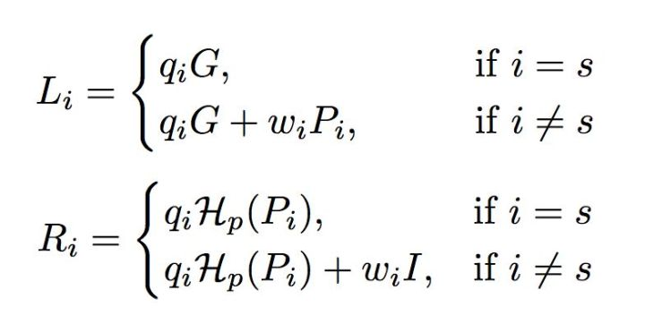
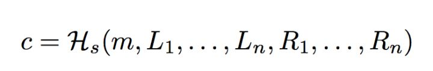
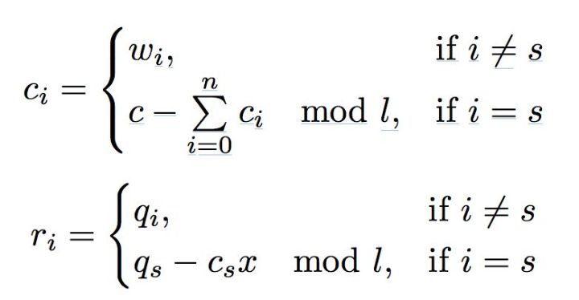
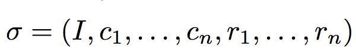
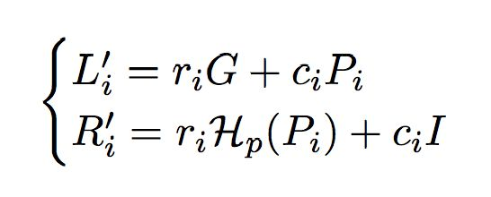
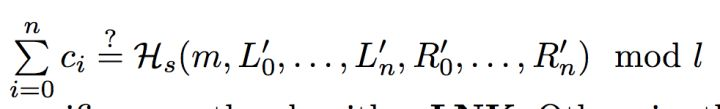

# Monero

## 设计理念

- 环签名（Ring Signature），用于发送方，具有不可追踪的效果

- 混淆地址（Stealth Address），用于接收方，具有不可追踪的效果

- 环机密交易，做到交易金额的隐匿
- 钥匙镜像，从而解决双花问题
- 私人交易数据，做到不可分析的效果
- 区块大小、挖矿难度能够自我动态调整
- 更加平等的挖矿算法

## Stealth Address

首先我们要确定的是，为什么我们需要 Stealth Address 。我们来假设一个这样的场景：

Alice 是一家店铺的店主，她可以接受各种数字货币，比如 BTC ， ETH 之类的。那么她的所有的账目都是可以通过她的收款地址来得到，这样作为商业对手的 Bob 等人就可以通过查询该地址的流水来对 Alice 进行价格上的攻击。于是，对于交易的隐私性就孕育而生了。

区别于 Bitcoin ， Monero 的地址是通过两对公钥组成。 spend 是一部分， view 是另一部分。

一个 Monero 的标准地址如下所示：

```
network byte 18 + public spend key + public view key + checksum
```

前面是网络编码（可简单理解为前缀），中间是公开支付钥匙 + 公开查看钥匙，后面是校验和（可简单理解为后缀）。

而对于 Stealth Address 来说，我们的创建方式是：

`P = Hs(rA)G + B`

对于上面这个式子，我们来解析一下：

1.  P ——最终的 Stealth Address ，即我们在交易中最终币打向的地址，是一个一次性地址。
2.  Hs ——一个hash的函数，返回一个 scalar 。
3.  r ——一个随机数，由发送方生成，且不公开。
4.  A ——接收方的 view 公钥
5.  G ——Ed25519的基点
6.  B ——接收方的 spend 公钥

那么，一笔这样的隐私交易的过程如下：

1. Bob需要选取两个数 a和b作为私钥，并在ECC椭圆曲线上计算出对应的公钥 A和B。A=aG, B=bG，G是曲线上一个公用的基点。然后Bob将计算出来的这两个公钥A、B向全网公布。
2. 现在Alice想向给Bob发起一笔交易，需要先获取到Bob公布的公钥A、B，然后选取一个随机整数r作为另一个私钥，通过公式 P=Hs(rA)G+B，计算出公开地址P。
3. Alice再通过公式 R=rG，将随机整数r转换成R
4. Alice创建转账交易，并将计算出的R、P一起记录到交易中公布到区块链上。由于使用了哈希函数，所以根据R、P是无法推断出A、B，从而无法获悉接收人是Bob。
5. Bob扫描区块链上的交易，根据公式 P'=Hs(aR)G+bG 计算P'，如果交易的接收人是Bob，根据aR = arG = rA，所以P'= Hs(aR)G+B = Hs(rA)G+B = P，也就是检测到P'=P时，就可以认为这笔交易是发给Bob的。
6. Bob根据公式 x=Hs(aR)+b，计算得到一个整数，因为有 xG = Hs(aR)G+bG = Hs(aR)G+B = P, 符合ECC算法定义，x就是针对公钥P的私钥，而这个私钥连给钱的Alice也无法推算出。日后Bob就可以使用这个私钥来花费这笔钱了。

## Ring Signature

### 定义

环签名方案也被称为门罗币方案或CryptoNode，**其工作方式脱胎于群签名**。
群签名是利用公开的群公钥和群签名进行验证的方案，其中群公钥是公开的，在进行验证时，群成员利用自身的群证书声称群签名，最终利用群签名和群公钥进行验证。在这个过程当中，**除群组管理员外**，验证者仅能利用群公钥验证所得群签名的正确性，但不能确定群中的正式签署者。但群签名方案的问题就在于群组管理员这样一个中心化的位置，即与区块链精神相悖，也无法保证隐私性。
环签名方案则去掉了群组管理员，不需要环成员之间的合作，签名者利用自己的私钥和集合中其他成员的公钥就能独立的进行签名，集合中的其他成员可能不知道自己被包含在了其中。这种方案的优势除了能够对签名者进行无条件的匿名外，环中的其他成员也不能伪造真实签名者签名。外部攻击者即使在获得某个有效环签名的基础上，也不能伪造一个签名。

### 过程

1. 生成随机数q，w
2. 对q，w进行转换



3. 零交互转换



4. 得到challenge 和 response



5. 最终签名



6. 根据signature保存的及其他数据，运用算法计算出L，R



7. 校验签名是否正确



综上所述
**签名就是：随机数 + 要签名的数据，已有的数据 + 算法 ---> 签名结果**
**校验就是：签名结果 + 要签名的数据，已有的数据 + 算法 ---> 校验结果**

