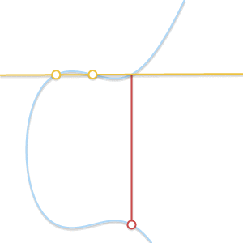

# 椭圆曲线算法

## 椭圆曲线介绍

椭圆曲线（EC），即形式为 的曲线，面对不同的a，b取值，其形状也是各不相同：

上图即为 b=1，a从2到-3 的取值的椭圆曲线形状。随着 a 和 b 的变化，曲线在平面上呈现不同的形状，但是有一点不会变，即始终是关于 x 轴对称的。

另外，我们还需要一个无穷处的点作为曲线的一部分，从现在开始，我们将用 0 这个符号表示无穷处的点。如果我们将无穷处的点也考虑进来的话，那么椭圆曲线的表达式精炼为：

## **群（Group）**

我们在一个集合上定义一个二元运算，这就是数学中的群。比如，二元运算-->“加法”并用符号“+”表示，（可以任意符号任意名字，此处仅为举例。也可以这么理解：一个群，由自身的集合和二元运算符‘+’组成），为了使集合  成为一个群，必须满足以下四个条件：

1. 封闭性（closure）：如果a和b被包含于  ，那么a+b 也一定是  的元素。
2. 结合律(associativity)。
3. 存在一个单位元（identity element）0，使得 a+0 = 0+a = a;[单位元：与任意元素运算不改变其值的元素]
4. 每个数都存在一个相反数(inverse)。

如果我们再加上第五个条件：

5. 交换律(commutativity):a+b = b+a.

这个群就叫做**阿贝尔群**(abelian group)。

从我们通常的加法概念来看，整数集  是一个群（而且是一个阿贝尔群）。自然数集  不是一个群，因为它不满足第4条。

群是非常好的，因为如果我们可以证明这四条属性，那么我们可以直接拿来用其他的属性了。比如，有且只有一个单位元，对应的相反数也是独一无二的，那么不论直接还是间接，关于群的所有属性和结论我们都可以随意使用。

于是，我们就在椭圆曲线上也定义了**群**：

1. 群中的元素就是椭圆曲线上的点。
2. 单位元就是无穷处的点0.
3. 相反数P，是关于X轴对称的另一边的点。
4. 加法规则定义如下：取一条直线上的三点（这条直线和椭圆曲线相交的三点），P, Q, R（皆非零），他们的总和等于0，P+Q+R=0。

同时，我们也没有规定三个点的顺序，所以，也是满足交换律的，即这也是一个阿贝尔群。

## 几何加法

由于椭圆曲线的点集属于一个阿贝尔群，所以我们可以将
P+Q+R=0写成 P+Q=−R。这个方程式让我们派生出了一个几何方法去计算两个点P和Q的和：当我们画一条直线通过P，Q，这条线将会和椭圆曲线相交于第三个点，R（这就暗示着P，Q，R三点是在一条直线上的）。如果我们取它相反的点，-R， 我们就可以找到P+Q 的结果。

这个几何方法非常有用但是还需要再精炼一下。让我们来回答一下以下几个问题：

- 如果 P = 0 或者 Q = 0 呢？很明显，这样我们是画不出线的，无穷远点0 不在xy平面上。但是我们已经定义了0作为单位元。 P + 0 = P 和 Q + 0 = Q，对于任意的P和Q都适用，单位元的作用就是与任意元素运算不改变其值的元素。
- 如果 P = -Q 呢？ 在这种情况下，穿过两点的直线是垂直的，没有相交的第三个点。但是呢，如果P是Q的相反数，然后我们将会从相反数的定义中得到 P+Q=P+(−P)=0。
- 如果 P = Q 呢？ 在这种情况下，有无数条线会经过这个点。我们假设一个点  . 当Q’越来越接近P的时候会发生什么？

当两点越来越接近，穿过两点的直线将会和曲线**相切**

当出现切线这种情况，鉴于此我们可以写成P+P=−R，R是曲线和切线的交点，P是切点。

* 如果当P!=Q，但是没有第三点R呢？这种情况与上一条非常相似。事实上，这种情况就是一条直线穿过P和Q与曲线相切。我们可以假设P是切点，在上一个情况下，我们已经说明了P+P=−Q，这个方程现在可以写成：P+Q=−P。

## 加解密的过程

首先我们要明确，在加密传输的过程中，私钥是不公开的，我们通过一个正向计算来将私钥转为公钥。确定椭圆曲线一个点作为基点P，由于所有的点构成一个有限群，那么基点P必然可以作为一个生成元生成一个子群。记这个子群的阶数为n，也就是说P点累加n次得到群的单位元（无穷远点），记做nP=0。（注意**此处0只是一个代号**，代指无穷远点，因为我们习惯了用0来表示加法单位元。）
       **正向计算的定义很简单，私钥为K; 基点为点P;公钥点Q定义为K个P相加：**

那么，假设基点是 G ，如果我们需要传递的消息为 x ，首先我们可以通过一个正向计算： G×k = K ，来获得公钥 K 。接着，我们可以计算出：

c1 = G × M ；c2 = K × M + x 。其中，M 为一个随机的值，由此，我们可以算出 c2 - c1 × k = K × M + x - k × G × M = x 。

