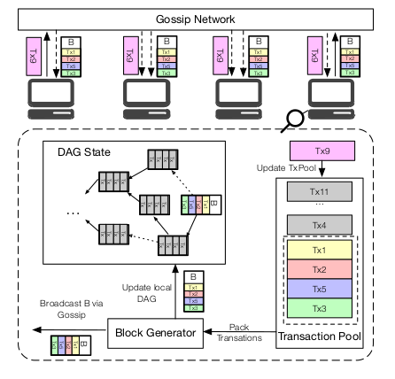
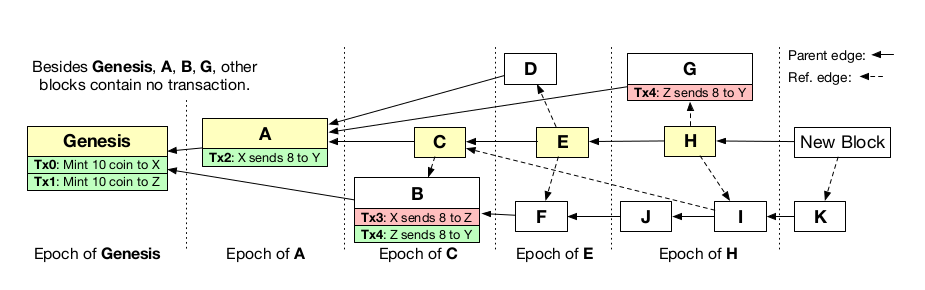

# Conflux

## 概述

conflux中其设计最重要的一环在于**推迟交易的总排序并优化处理并发交易和块**。

这是为什么呢？理由在于，在区块链中交易是不太会发生冲突的，那么Conflux就乐观的假设并发块中的交易默认是不会发生冲突的，所以我们只需要考虑在块生成器指定的“happens-before”关系就行了。这样就可以减少Conflux对于共识的约束，从而加快达成共识的速度。

## 架构

通过上图，我们可以看到Conflux的整体架构，那么，接下来我们来介绍一下各个组件。

* **Gossip Network**

Conflux中的所有节点都是通过Gossip Network进行连接的。每当新产生一笔交易时，通过Gossip Network进行广播；每当新生成一个区块，也是通过Gossip Network进行广播，例如，上图中Tx9和B这个区块。

* **Pending Transaction Pool**

上图右下角即为Transaction Pool。每一个节点维护一个Transaction Pool，交易池中包含所有尚未被打包的的交易，一旦节点通过Gossip Network接收到一笔交易，就会打入到交易池中；而一旦节点得知一个新区块的产生（无论是自身产生的还是监听到的），就会将交易池中的所有这个区块中的交易清除，比如上图中的Tx1，Tx2，Tx5和Tx3。这些交易我们会通过共识模块来处理，以防止在Conflux并行块中的重复打包。

* **Block Generator**

每个节点都运行一个Block Generator，用以生成新的有效区块对交易进行打包，Block Generator生成的区块可以通过调整区块头来适应不同的共识机制，比如PoW或者PoS之类的。

* **Local DAG State**

每个节点都维护一个Local DAG State，用以记录整体的交易记录。

## 共识机制

Conflux的共识时在每个节点本地的DAG结构中进行共识，共识的目的就在于在多个节点之间得到一个全节点出块order的一致性。下图是Conflux架构中DAG的解析图：

------

* 在DAG中我们有两种类型的edge

1. **Parent Edge：**

我们可以看到在上图中，除了创世区块，所有区块都存在一条实线，而这条实线就是我们所定义的**Parent Edge**。Parent Edge定义了一种投票关系，即子块对于父块中所有的交易进行投票，表示了一种信任关系，比如，C->A和F->B。

2. **Reference Edge：**

从上图中可以看到，一个区块可以存在多条虚线，这就是我们要介绍的**Reference Edge**，它代表的是一种时序关系，即区块生成的先后，例如E->D，这就说明了D先于E生成。

------

* **Pivot Chain**

我们可以从上图中看到有一条由黄色区块构成的链：**Genesis->A->C->E->H**。这就是一条我们要介绍的**Pivot Chain**。那么，这样一条Pivot Chain是如何备选出来的呢，**和我们所了解的Bitcoin选择一条从创世区块开始的最长的链不同**，Conflux是基于GHOST来选择这样一条链的。

**具体来说，我们从创世区块开始，每次都去计算本节点作为父节点，其子树所拥有的节点数量，我们每次选择节点数量最多的一个父节点作为下一个Pivot Chain上的节点。**

GHOST的优点在于，即使在面对因为delay而发生的分叉时，它也保证了我们所选出的Pivot Chain的不可逆转性，因为根据分析此时分叉的区块也有助于保证分叉的链的safety。

------

* **区块生成**

一旦我们生成一个新的区块，首先我们会去本地DAG中计算出Pivot Chain，将我们新生成的区块挂在Pivot Chain的最后，以保证最重的原则。同时也会找到所有**“叶子节点”**（没有被其他区块指向的），用虚线指向它们。

------

* **Epoch：**

Epoch有以下原则：

1. 每个Pivot Chain上的每个区块都在不同的Epoch
2. 每个Epoch中包含当前块可以通过Parent Edge和Reference Edge到达的区块
3. 每个Epoch中包含之前一个Epoch中未包含的区块

------

* **Block Total Order：**

首先要保证的是根据Epoch的次序，然后根据每个Epoch中的拓扑排序顺序，如果两个块没有partial，conflux根据区块id排序。

因此，上图的Order是： Genesis,A,B,C,D,F,E,G,J,I,H,K

------

* **Transaction Total Order：**

首先按Block Total Order进行排序，同一个块内按照块内出现顺序。协议抛弃与之前交易冲突的交易。对于出现在多个块内的交易只处理第一次而抛弃后面的。上图中，交易顺序为Tx0, Tx1, Tx2, Tx4。（抛弃与Tx2冲突的Tx3和重复的Tx4）。

------

* 攻击的安全分析

假如有人相对系统做出攻击，比如希望revert其中一笔交易，如Tx4，那么他就需要生成一个在B区块之前的区块，同时其中包含一笔与Tx4有冲突的交易，这样才能做到revert的效果。那么，如果我们生成一个区块是创世区块的子区块，即和B区块时兄弟区块，单这个区块由于没有子区块，所以无法成为Pivot Chain之中的一员，那么无论怎么样，它都无法成为B区块之前的一个区块，也就无法对B区块中的Tx4进行revert。

既然这样，那如果我们能做到revert Pivot Chain呢。如果我们能够做到这一点，就相当于是在Bitcoin上进行双花交易的攻击，那么如果我们能够保证诚实节点的力量能够大于攻击者的，随着时间推移，Pivot Chain的不可逆转型就会更加稳固了。