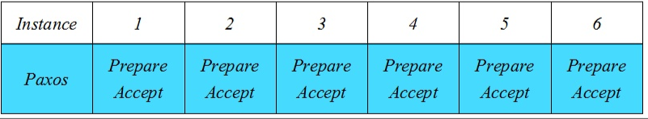

# Multi-Paxos

根据wiki上的解释：

```
一个典型的Paxos的部署需要一组连续的可以作为一个分布式状态机的一组命令的值。如果每组命令都需要通过一个Basic Paxos来实现一致性，那么就会产生大量的Latency。
如果Leader是一个相对比较稳定的，那么Basic Paxos的第一阶段就显得不是那么必须了，我们可以在接下来的Paxos算法中，跳过第一阶段，直接使用相同的Leader。
为了实现这一目的，在同一个Leader执行每轮Paxos算法时，提案编号I每次都进行递增。并将增值打包一起发送。因此，Multi-Paxos在没有故障发生的时候，将消息延迟（从prepare阶段到learn阶段）从4次减少到了2次。
```

## 推导

我们先引入一个**instance**的概念：

```
Basic Paxos算法通过多轮的Prepare/Accept过程来确定一个值，我们称这整个过程为一个Instance。
```

Multi-Paxos是通过Paxos算法来确定很多个值，而且这些值的顺序在各个节点完全一致。概括来讲就是确定一个**全局顺序**。

那么，最简单的方式就是



每个Instance独立运行一个Basic Paxos算法，我们保证仅当Instance i的值被确定后，方可进行i+1的Paxos算法，这样我们就保证了Instance的有序性。

但是由于Basic Paxos的Latency很高，所以我们需要进行一些优化，省去其中的一些步骤。

## 概念

Multi-Paxos中的Multi体现在，这是一个多次Paxos的过程，首先，我们需要进行一次Paxos的过程来确定一个Leader，而当我们能够确认一个稳定的Leader之后，我们就可以省去选举Leader的过程，而直接进行共识的阶段，这也就是为什么Multi-Paxos能够比Basic Paxos更快的原因。

首先我们来看一个Basic Paxos的过程：

```
Client   Proposer      Acceptor     Learner
   |         |          |  |  |       |  | --- First Request ---
   X-------->|          |  |  |       |  |  Request
   |         X--------->|->|->|       |  |  Prepare(N)
   |         |<---------X--X--X       |  |  Promise(N,I,{Va,Vb,Vc})
   |         X--------->|->|->|       |  |  Accept!(N,I,V)
   |         |<---------X--X--X------>|->|  Accepted(N,I,V)
   |<---------------------------------X--X  Response
   |         |          |  |  |       |  |
```

其中V = { Va，Vb，Vc }中最新的一个，即Propose_id最大的一个

那么，如果我们使用Multi-Paxos，并在已经确定了Leader的情况下：

```
Client   Proposer       Acceptor     Learner
   |         |          |  |  |       |  |  --- Following Requests ---
   X-------->|          |  |  |       |  |  Request
   |         X--------->|->|->|       |  |  Accept!(N,I+1,W)
   |         |<---------X--X--X------>|->|  Accepted(N,I+1,W)
   |<---------------------------------X--X  Response
   |         |          |  |  |       |  |
```

此时，我们**跳过了第一阶段**，直接进入一个广播的阶段，要注意的是，这里的Leader是需要保证稳定的。

## Leader的选取

虽然Multi-Paxos允许并行提交，但这种情况下效率是要退化到Basic Paxos的，所以我们并不希望长时间处于这种情况，Leader的作用是希望大部分时间都只有一个节点在提交，这样才能最大发挥Mulit-Paxos的优化效果。

我们观察Multi-Paxos可以发现，如何才会打破一个连续的Accept指令，这就是出现一个Promise指令，即出现了其他节点的Prepare提交。那么，我们该如何避免其他节点的提交呢？

**收到来自其他节点的Accept，则进行一段时间的拒绝提交请求。**


## 优化

1. 我们可以选取一个Learner作为一个Learner中的Leader的角色，由他来进行广播
2. Proposer只能将proposal发给Leader而不是所有的节点
3. 可以发送V的hash而不是原始数据