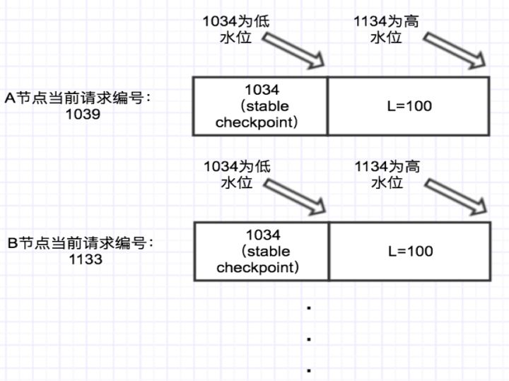
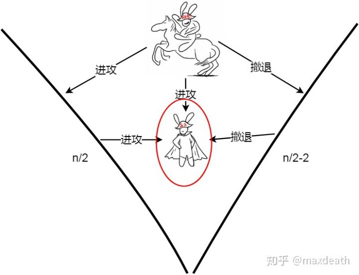
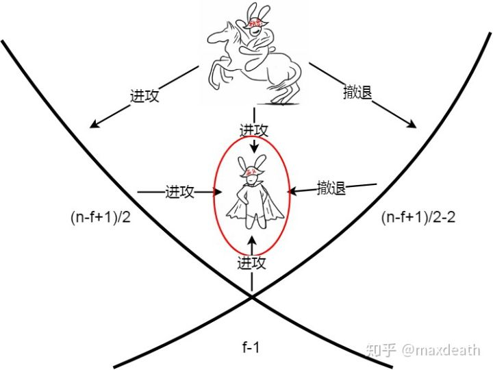

# PBFT

**拜占庭将军问题（Byzantine Generals Problem）**，是由Leslie Lamport在其同名论文中提出的分布式对等网络通信容错问题。在分布式计算中，不同的计算机通过通讯交换信息达成共识而按照同一套协作策略行动。但有时候，系统中的成员计算机可能出错而发送错误的信息，用于传递信息的通讯网络也可能导致信息损坏，使得网络中不同的成员关于全体协作的策略得出不同结论，从而破坏系统一致性。拜占庭将军问题被认为是容错性问题中最难的问题类型之一。

## 协议详解

PBFT是一种状态机副本复制算法，即服务作为确定有限状态机进行建模，状态机在分布式系统的不同节点进行副本复制。每个状态机的副本都保存了服务的状态，同时也实现了服务的操作。

在确定有限自动机中，每个状态对每个可能输入只有精确的一个转移，在输入顺序一致，起始状态一致的情况下输出也必然一致。这也就对PBFT算法中的副本提出了**两个限定** ：

1. **所有节点必须是确定性的。**也就是说，在给定状态和参数相同的情况下，操作执行的结果必须相同。
2. **所有节点必须从相同的状态开始执行。**

在这两个限定条件下，即使失效的副本节点存在，PBFT算法对所有非失效副本节点的请求执行总顺序达成一致，从而保证安全性。

将所有的副本组成的集合使用大写字母R表示，使用0到|R|-1的整数表示每一个副本。为了描述方便，假设|R|=3f+1，这里f是有可能失效的副本的最大个数。**尽管可以存在多于3f+1个副本，但是额外的副本除了降低性能之外不能提高可靠性。**

------

## 算法流程

1. request阶段：客户端向主节点发送请求。
2. pre-prepare阶段：主节点分配一个序列号n给收到的请求，然后向所有备份节点广播预准备消息，预准备消息的格式为`<<PRE-PREPARE,v,n,d>,m>`，这里v是视图编号，m是客户端发送的请求消息，d是请求消息m的摘要。但是并不是所有pre-prepare节点都会被接受。什么时候才不接受主节点发来的 pre-prepare 消息呢？一种典型的情况就是如果一个节点接受到了一条 pre-prepare 消息，消息里的 v 和 n 在之前收到里的消息是**曾经出现过的**，但是 d 和 m 却和之前的消息不一致，或者请求编号不在高低水位之间（高低水位的概念在下文会进行解释），这时候就会拒绝请求。**拒绝的逻辑就是主节点不会发送两条具有相同的 v 和 n ，但 d 和 m 却不同的消息。**
3. prepare阶段：备份节点i接受了预准备消息`<<PRE-PREPARE,v,n,d>,m>`，则进入准备阶段。在准备阶段的同时，该节点向所有副本节点发送准备消息`<PREPARE,v,n,d,i>`，并且将预准备消息和准备消息写入自己的消息日志**。**这里要注意一点，同一时刻不是只有一个节点在进行这个过程，可能有 n 个节点也在进行这个过程。因此节点是有可能收到其它节点发送的 prepare 消息的。在一定时间范围内，如果收到超过 2f 个不同节点的 prepare 消息，就代表 prepare 阶段已经完成。
4. commit阶段：向其它节点广播 commit 消息，同理，这个过程可能是有 n 个节点也在进行的。因此可能会收到其它节点发过来的 commit 消息，当收到 2f+1 个 commit 消息后（包括自己），代表大多数节点已经进入 commit 阶段，这一阶段已经达成共识，于是节点就会执行请求，写入数据。

预准备阶段和准备阶段确保所有正常节点对同一个视图中的请求序号达成一致。

准备阶段和确认阶段确保了节点执行了大多数都认可的操作。

### 高低水位

首先来介绍一下什么是checkpoint。

checkpoint 就是当前节点处理的最新请求序号。比如一个节点正在共识的一个请求编号是101，那么对于这个节点，它的 checkpoint 就是101。

那什么是 stable checkpoint （稳定检查点）呢？stable checkpoint 就是大部分节点 （2f+1） 已经共识完成的最大请求序号。比如系统有 4 个节点，三个节点都已经共识完了的请求编号是 213 ，那么这个 213 就是 stable checkpoint 了。

那设置这个 stable checkpoint 有什么作用呢？**最大的目的就是减少内存的占用**。因为每个节点应该记录下之前曾经共识过什么请求，但如果一直记录下去，数据会越来越大，所以应该有一个机制来实现对数据的删除。那怎么删呢？很简单，比如现在的稳定检查点是 213 ，那么代表 213 号之前的记录已经共识过的了，所以之前的记录就可以删掉了。

下面来介绍高低水位：

图中A节点的当前请求编号是 1039，即checkpoint为1039，B节点的 checkpoint 为1133。当前系统 stable checkpoint 为 1034 。那么1034这个编号就是低水位，而高水位 H=低水位 h+L ，其中L是可以设定的数值。因此图中系统的高水位为 1034+100=1134。

举个例子：如果 B 当前的 checkpoint 已经为 1134，而A的 checkpoint 还是 1039 ，假如有新请求给 B 处理时，B会选择等待，等到 A 节点也处理到和 B 差不多的请求编号时，比如 A 也处理到 1112 了，这时会有一个机制更新所有节点的 stabel checkpoint ，比如可以把 stabel checkpoint 设置成 1100 ，于是 B 又可以处理新的请求了，如果 L 保持100 不变，这时的高水位就会变成 1100+100=1200 了。

## 推导证明

### 证明方法1：

我们知道对于raft来说，最大容错节点是**（n-1）/2**，而对于pbft来说，最大容错节点则是**（n-1）/3**，是什么造成了这样的结果？现在我们来推导一下。

首先，我们知道raft和pbft本质的区别就是在于是否可以容许拜占庭错误，即节点是否可以作恶；对于raft来说，容错的节点只可能是故障节点，即节点因为系统繁忙、宕机或者网络问题等其它异常情况导致的无响应。假设集群的总结点数量为n，故障节点为f，那么根据少数服从多数，我们就可以得知，只要存在f+1个正确的节点，就可以容错f个故障节点，所以raft的最大容错节点数量就是**（n-1）/2**。

而对于pbft来说，因为 pbft 算法的除了需要支持容错故障节点之外，还需要支持容错作恶节点。假设集群节点数为 N，有问题的节点为 f。有问题的节点中，可以既是故障节点，也可以是作恶节点，或者只是故障节点或者只是作恶节点。那么会产生以下两种极端情况：

1. 第一种情况，f 个有问题节点既是故障节点，又是作恶节点，那么根据小数服从多数的原则，集群里正常节点只需要比f个节点再多一个节点，即 f+1 个节点，确节点的数量就会比故障节点数量多，那么集群就能达成共识。也就是说这种情况支持的最大容错节点数量是 （n-1）/2。
2. 第二种情况，故障节点和作恶节点都是不同的节点。那么就会有 f 个问题节点和 f 个故障节点，当发现节点是问题节点后，会被集群排除在外，剩下 f 个故障节点，那么根据小数服从多数的原则，集群里正常节点只需要比f个节点再多一个节点，即 f+1 个节点，确节点的数量就会比故障节点数量多，那么集群就能达成共识。所以，所有类型的节点数量加起来就是 f+1 个正确节点，f个故障节点和f个问题节点，即 3f+1=n。

综上所述，pbft的最大容错数量即为**（n-1）/3**。

### 证明方法2：

引入**Quorums**的概念。所谓quorum指的是做出一次决策至少需要的同意票数量。

1. 要满足**liveness**必须有

   **Q <= N - f**

   说明：如果共识算法需要的Q大于N-f，则当f个拜占庭故障节点都主动破坏时，算法必然不能执行下去

2. 要满足**safety**必须有

   **2Q - N > f**

   说明：任何两个quorum的交集（2Q - N）中必须有非拜占庭故障节点。如果不满足，即2Q - N <= f，此时f个节点同时加入到两个Quorum中说不同的话，系统内会同时通过两个不同的意见，此时系统一致性无法满足

因此

**N + f < 2Q <= 2(N - f)**

即，**N > 3f**

**每两个Quorum至少有一个公共正确的节点**

### 证明方法3：

首先我们先简单来假设一下，如果拜占庭问题中只有三位人（一位指挥官，两位将军），此时这个问题是无解的：

1. 将军收到“进攻”的指令的时候，他不能直接做出“进攻”的判定，**因为指挥官可能是叛徒。**
2. 于是将军收到指令之后，它必须向另一名将军询问指挥官给另一名将军的指令。
3. 假设这个时候将军从指挥官那收到了“进攻”，而另一名将军却告诉他“指挥官跟我说的是撤退”。而这个时候，这位将军就会陷入一个困境：第一种可能是，指挥官是诚实的并且向两个将军都下达了“进攻”的指令，但是另一名将军是叛徒并且篡改了指挥官的命令；而另一种可能是，指挥官是叛徒并且向两个将军各下达了不同的指令。作为这位可怜的将军，他无法分别这两种情况。
4. 这里来到了问题的重点：我们并不关心他的决定究竟是“进攻”还是“撤退”，我们关心的是，如果我们预设任何一种战术，例如：遇到上述情况时选择“进攻”（“撤退”），它能在某一种可能的时候达成目标，但是在另一种可能的时候失效。

当然，此时我们只需要**引入数字签名**就可以解决之前的问题，即便全世界只有两个将军是诚实的而其他将军全是叛徒，这两个将军也能达成共识。

但是在现实中，大多数系统都是异步的，消息是可能丢失的。加上了异步假设之后，拜占庭节点的能力变强了——之前，它只能通过谎报军情来迷惑其他人造成不一致，而现在，他多了一个选项，他可以假装断线不说话。

在这种情况下，三将军问题还没开始就结束了：

1. 如果指挥官是叛徒，他可能永远都不会发指令。

2. 于是，为了满足终止条件，所有的人必须要预设一个决定，例如“没有在t之前受到命令就撤退”。

3. 但如果将军是诚实的，然后消息恰好延误了超过t的时间，**那么这个算法失效。**

所以说，想要解决异步系统拜占庭将军问题，我们需要解决说假话和不说话两个问题（作恶节点和故障节点）。而实际上，因为有了签名，如果指挥官是诚实的，指挥官以外的叛徒说假话并没有什么作用，他们能够进行的恶意行为，只有不说话。因此，拜占庭将军问题，其实又被简化成了“**指挥官说假话**”和“**指挥官不说话的**”的问题。而这其中，指挥官不说话的问题，刚才我们已经用例子说明了是个无解的问题——当然，如果这个问题有解，也违背了FLP和CAP。

于是，我们只剩下一个问题——我们假设指挥官一定会下命令，而且每个人都知道这一点。那么指挥官说假话的时候，两个诚实的将军在异步系统里能不能达成共识？我们管这种假设叫做“**弱中止假设**”。

很可惜，答案还是否定的，以下是会出现的情况：

1. 指挥官会将两条不同的消息发给两个将军。

2. 两个将军必须互相交流意见，否则很显然在这种情况共识就失败了。

3. 然而，如果他们互相交流，那么又会陷入异步系统的经典问题——对方也有可能是恶意的，所以可能不会回复。所以，为了满足活性，他们必须在某个时间点，例如t，之前作出决定——如果这个决定是听指挥官的，那么如果指挥官是恶意的而两人之间的消息又恰好延迟了超过t的时间，两个诚实将军就又被恶意指挥官迷惑了；如果两人的决定是撤退，那么如果指挥官是诚实的，共识就又失败了。

**但是，上面的一系列问题在四将军的情况下就不是问题了：**

假设我是诚实将军A，我收到了命令“进攻”，因为外面最多有一个恶意节点，所以，我至少还会再收到一位将军发来的消息。

1. 这个时候，我收到了将军B的消息，他说他收到的是“撤退”，并且提供了指挥官的签名。**这个时候，我知道指挥官是恶意的，因为他发了两条不一样的消息。**于是，我知道我们三个将军都是诚实的，那么我们一定会把自己收到的东西发出来。所以，我知道我一定会等到将军C的消息，然后，如果他说他收到的是“进攻”，我就进攻，如果他说撤退，我们就撤退。

   这里，最重要的一点是——我也很清楚地知道，因为B和C也是诚实的，所以他们也会采用同样的算法，所以，我们最终会达成共识。

2. 如果我收到将军B的消息，他说他收到的是“进攻”，这个时候事情就有点麻烦了——因为我这个时候还不知道谁是叛徒。

   首先，假设将军B诚实，那么首先他不会撤退，因为他首先收到了“进攻”，然后，因为我发的是“进攻”，那么他最多只能收到一个撤退。**接着要么将军C是叛徒，要么指挥官是叛徒。如果是前者，那么共识达成，因为指挥官和我以及将军B达成了共识，如果是后者，那么C有可能收到指挥官发的“撤退”，但他仍旧会和我们达成共识，因为我和B都发了“进攻”他最多只收到一个”撤退“。**

   然后我们考虑将军B是叛徒，那么他只能选择不发给C消息（**他没法伪造因为他不知道将军签名**），但是这不重要，考虑到我和指挥官都是诚实的，C一定能收到两条“进攻”。

所以，我能够确定无论在什么情况下大家都能达成共识，也就代表这个算法成立。而这其中最重要的部分是——当我做出决定的时候，我能肯定别人一定不会做出相悖的决定。

------

**这个算法推而广之到n个将军的话，一般解法是这样的：**

假设有n个将军，f个将军是恶意的。

那么对于任何一个将军而言，**为了保证Liveness**，他最多只能等**n-f**条消息（包括指挥官）就必须做出判断，否则的话就有算法就可能不会结束。

假设我开始接收消息，然后接收到的一致的消息的数量开始缓慢增加，1,2,3……，直到k条。这里面有诚实节点发的，也有恶意节点发的，那么，这个k是多少的时候，我可以自信地认为一定能达成共识呢？

为了求k的值，我们考虑下这种情况：假设将军B收到了k条和我不一致的消息。

如果除了指挥官之外其他人都是诚实的，那么k应该是n/2+1，因为那样就代表至少有一个节点既发了消息给我又发了消息给B，也就是说他发了两条不一致的消息，这和他诚实矛盾。

当红圈的将军收到n/2+1条进攻（包括指挥官），说明收到指挥官撤退消息的人只有n/2-2个了，在图中很容易发现，没有人能够收到超过n/2+1条撤退。但是，如果左边少一个，右边多一个的话，这个结论就不成立了。

但是现在网络里除了指挥官之外，还有f-1个恶意节点，他们如果和指挥官合谋的话，n/2+1条消息就不够了，因为其中可能有f条消息是恶意节点发的。这个时候，我们需要的消息数量是(n+f+1)/2。只有这样，我才能确定其他人能够和我做出一样的判断。

这里，由于有f-1个恶意将军的存在（不包括指挥官），他们也许会给你发进攻但是给别人发撤退。所以你需要收到一共(n-f+1)/2+f-1+1=(n+f+1)/2条消息，才能确定没有人能够收到同样多条撤退。从这图上可以清楚地看到，多出的部分，就是延伸到右边的部分。

结合这两个条件，我们知道想要这个问题有解，我们需要同时满足这两个条件，**即当收到最多n-f条消息的时候，我们已经可以做出一致性的判断了，也即：(n+f+1)/2<=n-f，也就是n>=3f+1的条件下，弱中止条件下的拜占庭容错有解。**

## PBFT与PoW之间的比较

对于共识，我们知道关于共识的效率，所受的影响有两方面，一是确认时间，另一是可扩展性，这里的可扩展性包括了网络中各个节点的动态性，即不稳定性。

首先我们要确定的是，PBFT和PoW是完全不同的两种基于共识的方案。

PBFT是需要一定的前提的，需要各个节点之间知道彼此的公信力并且需要保证自己的节点有一定的稳定性。并且，我们之前所说的关于共识的效率中，我们也讨论了相关影响因素。在PBFT中，我们可以确定其确认时间是非常快速的，但是作为一种三阶段提交的变种，节点之间的交流导致了是一个O(n*n)的复杂度，而PoW则是简单的一次Broadcast的过程，将记账权的争夺和投票过程浓缩成为一个过程——挖矿。比如我们在一个系统中存在100个节点，在PBFT中，如果你需要确认网络中其他节点都收到了你的消息，整体网络就需要发送10000条消息，这样的性能显而易见是无法大幅提升的。

PoW作为一种很巧妙的投票方式，不需要节点两两之间通信询问情况，节点本身变化了就进行广播。与此同时，PoW的共识是不需要获得许可的。但是这也衍生了一个新的问题，因为我们都知道，网络中传输效率和延迟有瓶颈，所以当你需要广播的信息过大时，就可能会有损耗，从而影响可靠性。

所以综上所述，PoW这类共识更适合于公链这样的模式，而BFT的这类共识更适合联盟链或者私链这样的模式。