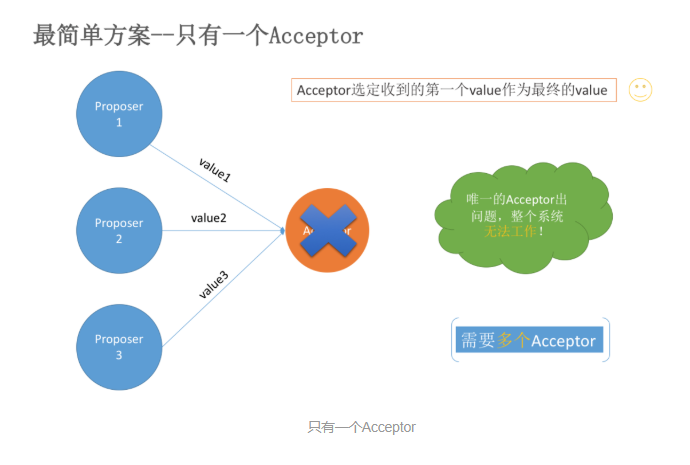
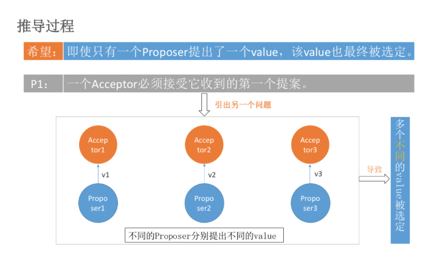
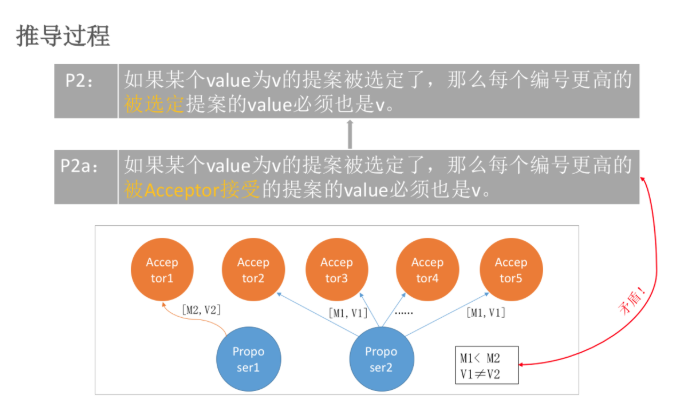

# Paxos make simple论文解析

## 问题产生的背景

在常见的分布式系统中，总会发生诸如**机器宕机**或**网络异常**（包括消息的延迟、丢失、重复、乱序，还有网络分区）等情况。Paxos算法需要解决的问题就是**如何在一个可能发生上述异常的分布式系统中，快速且正确地在集群内部对某个数据的值达成一致，并且保证不论发生以上任何异常，都不会破坏整个系统的一致性。**

这里某个数据的值并不只是狭义上的某个数，它可以是一条日志，也可以是一条命令（command）。根据应用场景不同，某个数据的值有不同的含义。

## 基本概念

Paxos要求满足的**前置假设**只有一个：消息内容不会被篡改；更正式的说是无拜占庭将军问题。

------

Paxos面向的是一个理论的一致问题，这个问题的**通俗描述**是：

有一个变量v，分布在N个进程中，每个进程都尝试修改自身v的值，它们的企图可能各不相同，例如进程A尝试令v=a,进程B尝试令v=b，但最终所有的进程会对v就某个值**达成一致**,即上述例子中如果v=a是v达成一致时的值，那么B上，最终v也会为a。**需要注意的是某个时刻达成一致并不等价于该时刻所有进程的本地的v值都相同**，有一个原因是进程可能挂掉，你不能要求挂掉的进程任何事；更像是最终所有存活的进程本地v的值都会相同。

------

这个一致性需要满足三个要求：

1. **v达成一致时的值是由某个进程提出的**。这是为了防止像这样的作弊方式：无论如何，最终都令每个进程的v为同一个预先设置好的值，例如都令v=2，那么这样的一致也太容易了，也没有任何实际意义。
2. 一旦v就某个值达成了一致，那么v**不能对另一个值再次达成一致**。这个要求称为Safety。
3. **一致总是能够达成**，即v总会被决定为某个值。这是因为不想无休止的等待，这个要求也称为Liveness。

------

在Paxos算法中,每个节点可以充当三种角色:

1. Proposer
2. Acceptor
3. Learner

**在具体的实现中，一个进程可能同时充当多种角色。**比如一个进程可能既是Proposer又是Acceptor又是Learner。

------

Paxos保证的**一致性**如下：**不存在这样的情形，某个时刻v被决定为c，而另一个时刻v又决定为另一个值d。**由这个定义我们也看到，当v的值被决定后，Paxos保证了它就像是个单机的不可变变量，不再更改。也因此，对于一个客户端可以多次改写值的可读写变量在不同的节点上的一致性问题，Paxos并不能直接解决，它需要和状态机复制结合。

------

Paxos基于的数学原理：  我们称**大多数进程组成的集合为法定集合**，**两个法定集合必然存在非空交集，即至少有一个公共进程，称为法定集合性质**。 例如A,B,C,D,F进程组成的全集，法定集合Q1包括进程A,B,C，Q2包括进程B,C,D，那么Q1和Q2的交集必然不在空，C就是Q1，Q2的公共进程。如果要说Paxos最根本的原理是什么，那么就是这个简单性质。同时，可以注意到，这个性质和达成一致的定义相呼应。

------

假设不同角色之间可以通过发送消息来进行通信，那么：

1. 每个角色以任意的速度执行，可能因出错而停止，也可能会重启。一个value被选定后，所有的角色可能失败然后重启，除非那些失败后重启的角色能记录某些信息，否则等他们重启后无法确定被选定的值。
2. 消息在传递过程中可能出现任意时长的延迟，可能会重复，也可能丢失。但是消息不会被损坏，即消息内容不会被篡改（拜占庭将军问题）。

------


## 算法推导

Paxos算法运行在允许宕机故障的异步系统中，不要求可靠的消息传递，可容忍消息丢失、延迟、乱序以及重复。它利用大多数 (Majority) 机制保证了**2F+1**的容错能力，**即2F+1个节点的系统最多允许F个节点同时出现故障。**

------

暂且认为**『提案=value』**，即提案只包含value。在我们接下来的推导过程中会发现如果提案只包含value，会有问题，于是我们再对提案重新设计。

暂且认为**『Proposer可以直接提出提案』**。在我们接下来的推导过程中会发现如果Proposer直接提出提案会有问题，需要增加一个学习提案的过程。

**Proposer**可以提出（propose）提案；**Acceptor**可以接受（accept）提案；如果某个提案被选定（chosen），那么该提案里的value就被选定了。

下面我们就来一步步推论Paxos算法

### 最简单的方案——只有一个Acceptor

假设只有一个Acceptor（可以有多个Proposer），只要Acceptor接受它收到的第一个提案，则该提案被选定，该提案里的value就是被选定的value。这样就保证只有一个value会被选定。

但是，如果这个唯一的Acceptor宕机了，那么整个系统就无法工作了！

因此，必须要有**多个Acceptor**！



### 多个Acceptor

如果我们希望即使只有一个Proposer提出了一个value，该value也最终被选定。

那么，就得到下面的约束：

```
P1：一个Acceptor必须接受它收到的第一个提案。
```

但是，这又会引出另一个问题：如果每个Proposer分别提出不同的value，发给不同的Acceptor。根据P1，Acceptor分别接受自己收到的value，就导致不同的value被选定。这样就永远无法达成共识。如下图：




因此，我们需要在增加一个约束：

```
规定：一个提案被选定需要被半数以上的Acceptor接受
```

这个规定又暗示了：**『一个Acceptor必须能够接受不止一个提案！』**不然可能导致最终没有value被选定。比如上图的情况。v1、v2、v3都没有被选定，因为它们都只被一个Acceptor的接受。

最开始讲的**『提案=value』**已经不能满足需求了，于是重新设计提案，给每个提案加上一个提案编号，表示提案被提出的顺序。令**『提案=提案编号+value』**

虽然允许多个提案被选定，但必须保证所有被选定的提案都具有相同的value值。否则又会出现不一致。

于是有了下面的约束：

```
P2：如果某个value为v的提案被选定了，那么每个编号更高的被选定提案的value必须也是v。
```

一个提案只有被Acceptor接受才可能被选定，因此我们可以把P2约束改写成对Acceptor接受的提案的约束P2a。

```
P2a：如果某个value为v的提案被选定了，那么每个编号更高的被Acceptor接受的提案的value必须也是v。
```

只要满足了P2a，就能满足P2。

但是，考虑如下的情况：假设总的有5个Acceptor。Proposer2提出[M1,V1]的提案，Acceptor2~5（半数以上）均接受了该提案，于是对于Acceptor2~5和Proposer2来讲，它们都认为V1被选定。Acceptor1刚刚从宕机状态恢复过来（之前Acceptor1没有收到过任何提案），此时Proposer1向Acceptor1发送了[M2,V2]的提案（ **V2≠V1且M2>M1** ），对于Acceptor1来讲，这是它收到的第一个提案。根据P1（一个Acceptor必须接受它收到的第一个提案。）,Acceptor1必须接受该提案！同时Acceptor1认为V2被选定。这就出现了两个问题：

1. Acceptor1认为V2被选定，Acceptor2~5和Proposer2认为V1被选定。**出现了不一致**。
2. V1被选定了，但是编号更高的被Acceptor1接受的提案[M2,V2]的value为V2，且V2≠V1。这就跟P2a（如果某个value为v的提案被选定了，那么每个编号更高的被Acceptor接受的提案的value必须也是v）矛盾了。



所以我们要对P2a约束进行强化！

P2a是对Acceptor接受的提案约束，但其实提案是Proposer提出来的，所有我们可以对Proposer提出的提案进行约束。得到P2b：

```markdown
P2b：如果某个value为v的提案被选定了，那么之后任何Proposer提出的编号更高的提案的value必须也是v。
```

由P2b可以推出P2a进而推出P2。

那么，**如何确保在某个value为v的提案被选定后，Proposer提出的编号更高的提案的value都是v呢**？

只要满足P2c即可：

```
P2c：对于任意的N和V，如果提案[N, V]被提出，那么存在一个半数以上的Acceptor组成的集合S，满足以下两个条件中的任意一个：
1. S中每个Acceptor都没有接受过编号小于N的提案。
2. S中Acceptor接受过的最大编号的提案的value为V。
```

