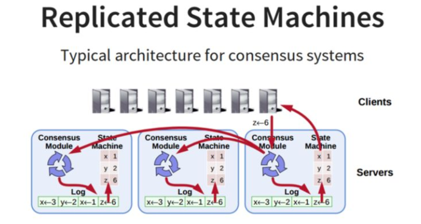
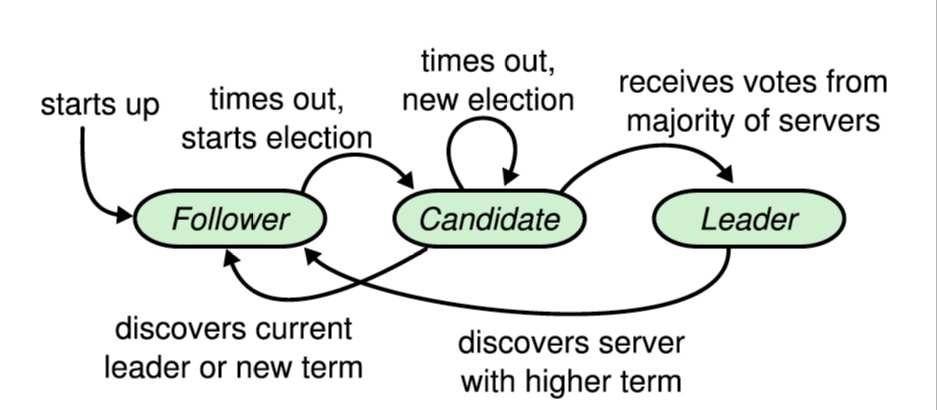

# RAFT协议详解

分布式存储系统通常通过维护多个副本来进行容错，提高系统的可用性。要实现此目标，就必须要解决分布式存储系统的最核心问题：**维护多个副本的一致性。**

**一致性：**在一个具有一致性的性质的集群中，同一时刻中所有的节点对于存储在其中的某个值都有相同的结果，即对其共享的存储保持一致。

一致性协议就是用来干这事的，用来保证**即使在部分(确切地说是小部分)副本宕机**的情况下，系统仍然能正常对外提供服务。一致性协议通常基于replicated state machines（复制状态机），即所有结点都从同一个state出发，都经过同样的一些操作序列（log），最后到达同样的state。

## 架构

系统中每个节点有三个组件：

1. 状态机：**当我们说一致性的时候，实际就是在说要保证这个状态机的一致性。**状态机会从log里面取出所有的命令，然后执行一遍，得到的结果就是我们对外提供的保证了一致性的数据。
2. Log：保存了所有的修改记录。
3. 共识模块：共识模块算法就是用来保证写入的log的命令的一致性，这也是raft算法核心内容。

## 协议内容

Raft 是一种分布式一致性协议，类似的协议还有我们之前讲过的Paxos，可以把 Raft 协议看作是 Paxos 协议的变种。Raft 主打的是易理解，其易理解主要在两方面：

1. 强化 leader 的作用，日志只能从 leader 流向 follower
2. 日志是连续的，中间没有空洞

Raft协议的每个副本都会处于三种状态之一：**Leader、Follower、Candidate**

1. **Leader：**所有请求的处理者，Leader副本接受client的更新请求，本地处理后再同步至多个其他副本；
2. **Follower：**请求的被动更新者，从Leader接受更新请求，然后写入本地日志文件。
3. **Candidate：**如果Follower副本在一段时间内没有收到Leader副本的heartbeat，则判断Leader可能已经故障，此时启动选主过程，此时副本会变成Candidate状态，直到选主结束。

### Leader Election