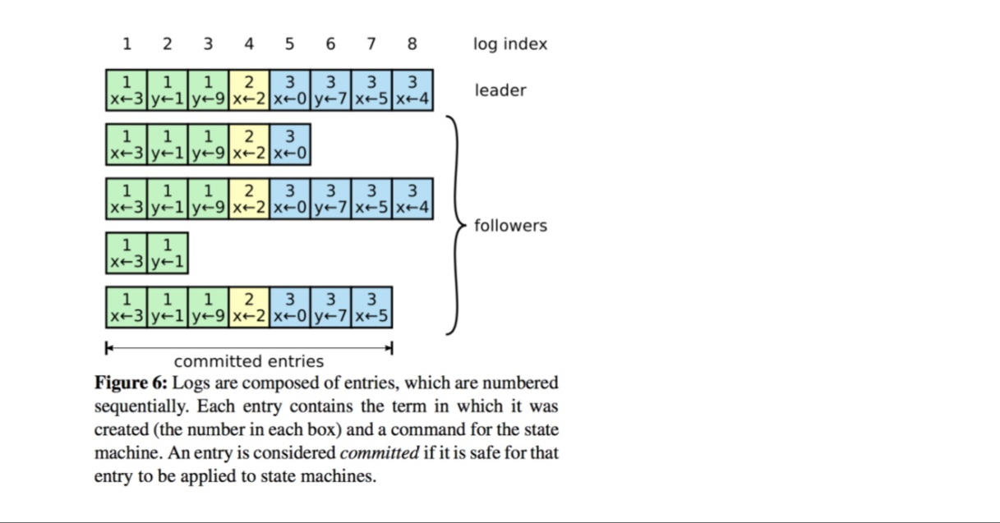
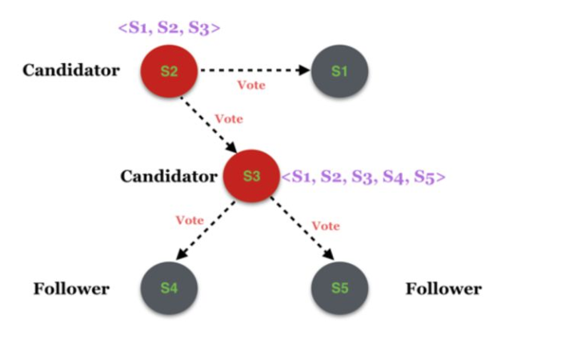

# RAFT协议详解

我们都知道，当代分布式一致性协议可以说是由Paxos领导的，而Paxos的出发点是从分布式一致性问题的角度出发，而我们本文要介绍的Raft则是从多副本状态机的角度提出推导。

分布式存储系统通常通过维护多个副本来进行容错，提高系统的可用性。要实现此目标，就必须要解决分布式存储系统的最核心问题：**维护多个副本的一致性。**

**一致性：**在一个具有一致性的性质的集群中，同一时刻中所有的节点对于存储在其中的某个值都有相同的结果，即对其共享的存储保持一致。

一致性协议就是用来干这事的，用来保证**即使在部分(确切地说是小部分)副本宕机**的情况下，系统仍然能正常对外提供服务。一致性协议通常基于replicated state machines（复制状态机），即所有结点都从同一个state出发，都经过同样的一些操作序列（log），最后到达同样的state。

## 架构

系统中每个节点有三个组件：

1. 状态机：**当我们说一致性的时候，实际就是在说要保证这个状态机的一致性。**状态机会从log里面取出所有的命令，然后执行一遍，得到的结果就是我们对外提供的保证了一致性的数据。
2. Log：保存了所有的修改记录。
3. 共识模块：共识模块算法就是用来保证写入的log的命令的一致性，这也是raft算法核心内容。

### 复制状态机

我们知道，复制状态机通过集群方式，由此给客户提供一个强一致、高可用的数据服务。所谓强一致，就是客户看来他们可以一直读到最新的写成功的数据；而在服务内部就是一个所有状态机中的数据高度一致的现象。而高可用，就是即使出现网络延迟、丢包、乱序、服务器宕机的情况，数据已就可以保证一致性。

对于复制状态机来说，他们是按序读取本地的log信息，由此来进行计算从而得到一个输出的。

### Log

我们可以看到，上图就是我们Raft协议的一个核心数据结构——Log。

1. 每一条日志都有日志序号（log index）
2. 每一条日志记录除了保存 state machine 要执行的操作（如 x ← 0）外，还需要保存该操作对应的 Term
3. **由Leader决定什么时候对记录进行commit**：当一条记录已经在至少半数的Follower上持久化后，Leader可以将该记录commit，并提供给state machine执行对应的操作
4. **Leader给Follower的复制日志请求中（AppendEntries RPC），不仅包含具体的操作，还包含本次插入的前一个位置的index和Term。**

## 协议内容

Raft 是一种分布式一致性协议，类似的协议还有我们之前讲过的Paxos，可以把 Raft 协议看作是 Paxos 协议的变种。Raft 主打的是易理解，其易理解主要在两方面：

1. 强化 leader 的作用，日志只能从 leader 流向 follower
2. 日志是连续的，中间没有空洞

即，**Raft是一种基于多副本的强Leader的一致性算法**

Raft协议的每个副本都会处于三种状态之一：**Leader、Follower、Candidate**

1. **Leader：**所有请求的处理者，Leader副本接受client的更新请求，本地处理后再同步至多个其他副本；
2. **Follower：**请求的被动更新者，从Leader接受更新请求，然后写入本地日志文件。
3. **Candidate：**如果Follower副本在一段时间内没有收到Leader副本的heartbeat，则判断Leader可能已经故障，此时启动选主过程，此时副本会变成Candidate状态，直到选主结束。

### Leader Election

当Leader节点由于异常（宕机、网络故障等）无法继续提供服务时，可以认为它结束了本轮任期（Term=n），需要开始新一轮的Leader Election，而新的Leader当然要从Follower中产生，开始新一轮的任期（Term=n+1）。

我们在这里简单介绍一下Term的含义，作为一个logic clock，Term有两个主要作用：

1. 识别过期信息
2. 通过限制使得在每个Term之内只能进行一次投票，由此来保证每个Term之中只会存在一个Leader。

首先我们明确，系统的初始状态是不存在Leader的，各个成员都是以Follower的形式存在，由于在一定时间内没有收到Heartbeat，此时Follower会进行一个竞选的过程：

1. 节点状态从Follower变成Candidate，对自己节点的Term自加1
2. 所有Candidate节点给自己投1票，同时向其他所有节点发送拉票请求（RequestVoteRPC）
3. Candidate节点等待投票结果

在这里我们有三种可能：

1. **自己被选成了主。**当收到了majority的投票后，状态切成Leader，并且定期给其它的所有server发Heartbeat消息（不带log的AppendEntriesRPC）以告诉对方自己是current_term_id所标识的term的leader。**每个term最多只有一个Leader**，term id作为logical clock，在每个RPC消息中都会带上，**用于检测过期的消息**。当一个server收到的RPC消息中的rpc_term_id比本地的current_term_id更大时，就更新current_term_id为rpc_term_id，并且如果当前state为leader或者candidate时，将自己的状态切成follower。如果rpc_term_id比本地的current_term_id更小，则拒绝这个RPC消息。
2. **别人成为了主。**如1所述，当Candidator在等待投票的过程中，收到了大于或者等于本地的current_term_id的声明对方是leader的AppendEntriesRPC时，则将自己的state切成follower，并且更新本地的current_term_id。
3. **没有选出主。**当投票被瓜分，没有任何一个candidate收到了majority的vote时，没有leader被选出。这种情况下，每个candidate等待的投票的过程就超时了，**接着candidates都会将本地的current_term_id再加1**，发起RequestVoteRPC进行新一轮的leader election。

投票策略：

* 每个节点只会给每个term投一票，具体的是否同意和后续的Safety有关。
* 当投票被瓜分后，所有的candidate同时超时，然后有可能进入新一轮的票数被瓜分，为了避免这个问题，Raft采用一种很简单的方法：每个Candidate的election timeout从150ms-300ms之间随机取，那么第一个超时的Candidate就可以发起新一轮的leader election，带着最大的term_id给其它所有server发送RequestVoteRPC消息，从而自己成为leader，然后给他们发送心跳消息以告诉他们自己是主。

不难解释，不是所有的Follower都有资格成为Leader，因为如果一个Follower缺少之前的Leader已经commit的Log，那么它无论如何都无法复制到缺少的那部分Log的，所以我们在这里有一个约束：

**Candidate在拉票时需要携带自己本地已经持久化的最新的日志信息，等待投票的节点如果发现自己本地的日志信息比竞选的Candidate更新，则拒绝给他投票。**

### Log Replication

当Leader被选出来后，就可以接受客户端发来的请求了，每个请求包含一条需要被replicated state machines执行的命令。leader会把它作为一个log entry append到日志中，然后给其它的server发AppendEntriesRPC请求。当Leader确定一个log entry被safely replicated了（大多数副本已经将该命令写入日志当中），就apply这条log entry到状态机中然后返回结果给客户端。如果某个Follower宕机了或者运行的很慢，或者网络丢包了，Leader会无限的重试 AppendEntries RPC直到所有的Followers最终存储了所有的日志条目。

当一条日志是commited时，Leader才可以将它应用到状态机中。Raft保证一条commited的log entry已经持久化了并且会被所有的节点执行。

当一个新的Leader被选出来时，它的日志和其它的Follower的日志可能不一样，这个时候，就需要一个机制来保证日志的一致性。

下面我们来看一个具体的范例：

我们可以看到，相较于选出的Leader，下面的Follower有些缺少Log，有些则有多余的Log，甚至有的有多也有少。这样的情况是怎么出现的呢？比如节点f，出现这样的情况就可能是：

1. 节点f在Term 2时是Leader，在提交了几条记录后，还未执行commit就下线
2. 节点f在Term 3时再次上线并成为Leader，在提交了几条记录后，还未执行commit（包括Term 2的commit）就又一次下线

当然，在出现上述情况的时候，我们依靠单纯的复制Log是不行的，所以我们需要这样做：

Leader为每一个Follower节点维护一个nextIndex计数，对于每一个Follower节点，首先设置nextIndex为Leader节点的下一个index位置（上图中为11），然后依次向前比较Leader和Follower对应的记录，直到找到重合的记录为止，（对于节点f来说，即上图中的3）再将所有Leader节点的记录复制到Follower节点。

由此，我们可以总结一句话：**Leader负责一致性检查，同时让所有的Follower都和自己保持一致**

------

之前我们说过Leader的选举不是任意的，而是有限制的，即需要Candidate拥有上一任Leader的所有已经commit的Log，但是光光有这个限制是不够的，我们再来看一个实例：

1. 在阶段a，term为2，S1是Leader，且S1写入日志（term, index）为(2, 2)，并且日志被同步写入了S2；

2. 在阶段b，S1离线，触发一次新的选主，此时S5被选为新的Leader，（由于S2已同步了term为2的Log，根据之前我们的限制，S2是不会投票给S5的，那么只有可能是S3，S4和S5自己投票给自己，由此让S5成为Leader）此时系统term为3，且写入了日志（term, index）为（3， 2）;

3. S5尚未将日志推送到Followers就离线了，进而触发了一次新的选主，而之前离线的S1经过重新上线后被选中变成Leader，此时系统term为4，此时S1会将自己的日志同步到Followers，按照上图就是将日志（2， 2）同步到了S3，而此时由于该日志已经被同步到了多数节点（S1, S2, S3），因此，此时日志（2，2）可以被commit了。

4. 在阶段d，S1又下线了，触发一次选主，而S5有可能被选为新的Leader（这是因为S5可以满足作为主的一切条件：1. term = 5 > 4，2. 最新的日志为（3，2），比大多数节点（如S2/S3/S4的日志都新）），然后S5会将自己的日志更新到Followers，于是S2、S3中已经被提交的日志（2，2）被截断了。

这就引出了一个问题，我们在增加上述限制后，依旧还存在问题：即使日志（2，2）已经被大多数节点（S1、S2、S3）确认了，但是它不能被提交，因为它是来自之前term（2）的日志，直到S1在当前term（4）产生的日志（4， 4）被大多数Followers确认，S1方可提交日志（4，4）这条日志，当然，根据Raft定义，（4，4）之前的所有日志也会被提交。此时即使S1再下线，重新选主时S5不可能成为Leader，因为它没有包含大多数节点已经拥有的日志（4，4）。

因此，我们对Raft的Leader选举提出了又一个限制：**只允许Leader提交（commit）当前Term的日志**

------

Raft日志同步保证如下两点：

- 如果不同日志中的两个条目有着相同的索引和任期号，则它们所存储的命令是相同的。
- 如果不同日志中的两个条目有着相同的索引和任期号，则它们之前的所有条目都是完全一样的。

第一条特性源于Leader在一个term内在给定的一个log index最多创建一条日志条目，同时该条目在日志中的位置也从来不会改变。

第二条特性源于 AppendEntries 的一个简单的一致性检查。当发送一个 AppendEntries RPC 时，Leader会把新日志条目紧接着之前的条目的log index和term都包含在里面。如果Follower没有在它的日志中找到log index和term都相同的日志，它就会拒绝新的日志条目。

### Safety

我们来回顾一下之前我们定义的一些约束：

1. **Candidate在拉票时需要携带自己本地已经持久化的最新的日志信息，等待投票的节点如果发现自己本地的日志信息比竞选的Candidate更新，则拒绝给他投票。**
2. **只允许Leader提交（commit）当前Term的日志**

第一条帮助我们限制了Leader的选举，从而保证了不会有已经被commit的Log因为宕机或者丢包之类的情况而导致的Log丢失。在任何基于Leader的共识算法里，我们必须要保证Leader的正确性，确定Leader包含所有已经commit的Log，这样就可以保证我们的数据流只会从Leader流向Follower，而Leader永远不会重写自己日志中已经存在的entry log。

------

### Log Compaction

在实际的系统中，不能让日志无限增长，否则系统重启时需要花很长的时间进行回放，从而影响availability。Raft采用对整个系统进行snapshot来处理，**snapshot之前的日志都可以丢弃**。Snapshot技术在Chubby和ZooKeeper系统中都有采用。

Raft使用的方案是：**每个副本独立的对自己的系统状态进行Snapshot，并且只能对已经提交的日志记录（已经应用到状态机）进行snapshot。**

Snapshot中包含以下内容：

- 日志元数据。最后一条已提交的 log entry的 log index和term。这两个值在snapshot之后的第一条log entry的AppendEntries RPC的完整性检查的时候会被用上。一旦这个server做完了snapshot，就可以把这条记录的最后一条log index及其之前的所有的log entry都删掉。
- 系统当前状态。

snapshot的缺点就是**不是增量**的，**即使内存中某个值没有变，下次做snapshot的时候同样会被dump到磁盘**。当leader需要发给某个follower的log entry被丢弃了(因为leader做了snapshot)，leader会将snapshot发给落后太多的follower。或者当新加进一台机器时，也会发送snapshot给它。发送snapshot使用新的RPC，InstalledSnapshot。

做snapshot既不要做的太频繁，否则消耗磁盘带宽， 也不要做的太不频繁，否则一旦节点重启需要回放大量日志，影响可用性。推荐当日志达到某个固定的大小做一次snapshot。

做一次snapshot可能耗时过长，会影响正常日志同步。可以通过使用**copy-on-write**技术避免snapshot过程影响正常日志同步。

### 集群成员变化

集群成员变化是在集群运行过程中副本发生变化，如增加/减少副本数、节点替换等

成员变更也是一个分布式一致性问题，既所有服务器对新成员达成一致。但是成员变更又有其特殊性，因为在成员变更的一致性达成的过程中，参与投票的进程会发生变化。

如果将**成员变更当成一般的一致性问题**，直接向Leader发送成员变更请求，Leader复制成员变更日志，达成多数派之后提交，各服务器提交成员变更日志后从旧成员配置（Cold）切换到新成员配置（Cnew）。

但是因为各个服务器提交成员变更日志的时刻可能不同，造成各个服务器从旧成员配置（Cold）切换到新成员配置（Cnew）的时刻不同。

成员变更不能影响服务的可用性，但是成员变更过程的某一时刻，可能出现在Cold和Cnew中同时存在两个不相交的多数派，进而可能选出两个Leader，形成不同的决议，破坏安全性。

综上所述，我们并不能将成员变更当做一般的一致性问题来解决。

**上图就是成员变更的某一时刻Cold和Cnew中同时存在两个不相交的多数派**

为了解决这一问题，Raft提出了两阶段的成员变更方法。集群先从旧成员配置Cold切换到一个过渡成员配置，称为共同一致（joint consensus），**共同一致是旧成员配置Cold和新成员配置Cnew的组合Cold U Cnew**，一旦共同一致Cold U Cnew被提交，系统再切换到新成员配置Cnew。

整个集群成员变化的流程如下：

1. 当集群成员配置改变时，leader收到人工发出的重配置命令从Cold切成Cnew；
2. Leader副本在本地生成一个新的log entry，其内容是Cold∪Cnew，代表当前时刻新旧成员配置共存，写入本地日志，同时将该log entry推送至其他Follower节点
3. Follower副本收到log entry后更新本地日志，并且此时就以该配置作为自己了解的全局成员结构，
4. 如果多数Follower确认了Cold U Cnew这条日志的时候，Leader就Commit这条log entry；
5. 接下来Leader生成一条新的log entry，其内容是全新的配置Cnew，同样将该log entry写入本地日志，同时推送到Follower上；
6. Follower收到新的配置日志Cnew后，将其写入日志，并且从此刻起，就以该新的配置作为系统成员配置，并且如果发现自己不在Cnew这个配置中会自动退出
7. Leader收到多数Follower的确认消息以后，给客户端发起命令执行成功的消息

异常分析：

1. 如果Leader的Cold U Cnew尚未推送到Follower，Leader就挂了，此后选出的新Leader并不包含这条日志，此时新Leader依然使用Cold作为自己的成员配置。
2. 如果Leader的Cold U Cnew推送到大部分的Follower后就挂了，此后选出的新Leader可能是Cold也可能是Cnew中的某个Follower。
3. 如果Leader在推送Cnew配置的过程中挂了，那么同样，新选出来的Leader可能是Cold也可能是Cnew中的某一个，此后客户端继续执行一次改变配置的命令即可。
4. 如果大多数的Follower确认了Cnew这个消息后，那么接下来即使Leader挂了，新选出来的Leader肯定位于Cnew中。

假设Cold为拓扑为(S1, S2, S3)，且S1为当前的Leader，如下图：

假如此时变更了系统配置，将集群范围扩大为5个，新增了S4和S5两个服务节点，这个消息被分别推送至S2和S3，但是假如只有S3收到了消息并处理，S2尚未得到该消息

这时在S2的眼里，拓扑依然是<S1, S2, S3>，而在S3的眼里拓扑则变成了<S1, S2, S3, S4, S5>。假如此时由于某种原因触发了一次新的选主，S2和S3分别发起选主的请求：

**最终，候选者S2获得了S1和S2自己的赞成票，那么在它眼里，它就变成了Leader，而S3获得了S4、S5和S3自己的赞成票，在它眼里S3也变成了Leader**，那么多Leader的问题就产生了。而产生该问题的最根本原因是S2和S3的系统视图不一致。

虽然两阶段成员变更比较通用且容易理解，但是实现比较复杂，同时两阶段的变更协议也会在一定程度上影响变更过程中的服务可用性，因此我们期望增强成员变更的限制，以简化操作流程。

两阶段成员变更，之所以分为两个阶段，**是因为对Cold与Cnew的关系没有做任何假设**，为了避免Cold和Cnew各自形成不相交的多数派选出两个Leader，才引入了两阶段方案。

如果增强成员变更的限制，假设Cold与Cnew任意的多数派交集不为空，这两个成员配置就无法各自形成多数派，那么成员变更方案就可能简化为一阶段。

**那么如何限制Cold与Cnew，使之任意的多数派交集不为空呢？方法就是每次成员变更只允许增加或删除一个成员。**

可从数学上严格证明，只要每次只允许增加或删除一个成员，Cold与Cnew不可能形成两个不相交的多数派。

一阶段成员变更：

- 成员变更限制每次只能增加或删除一个成员（如果要变更多个成员，连续变更多次）。
- 成员变更由Leader发起，Cnew得到多数派确认后，返回客户端成员变更成功。
- **一次成员变更成功前不允许开始下一次成员变更**，因此新任Leader在开始提供服务前要将自己本地保存的最新成员配置重新投票形成多数派确认。
- Leader只要开始同步新成员配置，即可开始使用新的成员配置进行日志同步。

------

## 数据结构

## 服务器的状态

上图中我们可以看到，在每台服务器中我们都有一些需要持久化的结构，比如Term、日志序列等。下面我来具体介绍一下：

1. 每个服务器都有自己的日志序列（Log[]），**日志序号索引从1开始**，因为0有特殊意义，表示服务器刚刚初始化还没有包含任何日志。日志序列非常重要，是它决定了状态机的状态。
2. 每个服务器都必须有当前的任期号（currentTerm），从零开始，以后逐渐单向往上递增。服务器重启后需要知道当前的任期号才可以正确的很其它节点交流，**所以任期号是必须持久化的**。
3. 如果给候选节点投票了，要记录下被投票的候选节点ID（votedFor）。如果节点在选举期间给了一个候选人投票后突然宕机重启了，如果没有记下这个值，就很可能会重复投票，又给另一个节点投票去了。**这就会导致集群存在多个Leader，也就是集群分裂**。
4. 当前已经提交的日志索引位置，服务器初始化时这个值是零表示还没有任何日志被提交。这个位置之前的所有日志都可以安全地应用到状态机中而不用当心会被覆盖。
5. 当前已经被应用到状态机的日志索引位置，它一般和提交索引保持一致。因为一旦提交索引前进了，那么新的已经提交的日志就会立即应用到状态机中，而不应该有任何延时。
6. Leader需要记录自身日志和所有的Follower日志的匹配位置matchIndex。matchIndex之前的日志Leader和Follower都是一致的。同时还需要记录下一个即将需要同步给Follower的日志位置。处于matchIndex和nextIndex之间的日志就是那些正在同步中的日志，是Leader已经向Follower发过去的AppendEntries消息还没有得到成功回应的日志列表，用一个高大上的词汇来描述那就是inflight logs。

### 选举阶段候选人请求投票RPC

1. 候选人需要携带自己的任期号，供目标节点比较。同时要提供节点ID，因为投票的节点需要记录被投票的节点ID，就是前文中的voteFor字段。
2. 候选人需要携带自身日志序列的最后一条日志的任期和索引号，供目标节点进行日志的比较。
3. 如果候选人的任期号比自己还小，那么就拒绝投票。
4. 如果自己在当期任期已经投票了，那么也必须拒绝投票。**同一任期内不得重复投票**，否则会导致多个Leader的产生，也就是集群分裂。
5. 否则比较尾部日志的任期号和索引值，如果候选人的日志更新一些，那就支持投票。否则就拒绝投票。
6. 拒绝投票一般不是不响应投票请求，而是快速地给予一个状态为failure的响应。还需要携带投票者的任期号，以便候选人能跟上时代（更新自己的任期号）。
7. 所谓日志的update-to-date，指的是最后一条的任期号是否更大，如果一样大的话，最后一条的日志序号是否更大。

### 日志复制阶段Leader的日志同步请求

1. 日志同步需要携带Leader的任期号和Leader的节点ID。之所以要携带节点ID，是因为Follower可以告知客户端Leader是哪个节点，因为客户端第一次来连的时候可能是选择了任意一个节点。
2. 日志同步需要携带需要同步的日志列表以及日志列表前面最后一条日志的索引prevLogIndex和任期号prevLogTerm。Follower需要这两个值来和自己的本地日志进行比对。
3. 日志同步需要携带Leader的日志提交索引值，如果这个值比本地日志的提交索引值要大，那就将本地的这个值往前进。提交索引值之前的所有日志就可以安全的apply到状态机了。
4. 如果同步请求的任期号比Follower的任期号还小，那就直接拒绝，并带上自己的任期号，以便Leader进行跟上时代（更新自己的任期号）。
5. 如果Follower本地日子的prevLogIndex位置处没有日志或者对应的term不匹配，那就拒绝同步。**同时将日志在不匹配的位置处进行截断，后面的所有日志统统剁掉。**
6. Leader收到了Follower的拒绝时，如果响应的任期号比Leader本身还大，那么Leader理解退职变身Follower。如果响应的任期号不超过Leader，Leader就将同步的日志列表往前挪一个位置，再重试同步请求。
7. Follower如果在prevLogIndex处日志的term和请求消息中的prevLogTerm匹配，那么就将消息中的日志追加到自身的日志序列上，这个时候就可以向Leader响应成功了。
8. Leader收到成功响应后，更新内部记录节点的matchIndex值，然后再前进全局的commitIndex值，并将最近刚刚成功提交的日志应用到状态机中。

