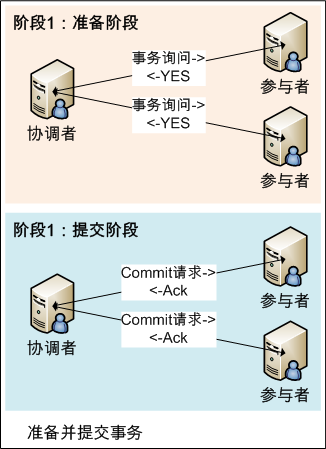

# 2PC和3PC

## 2PC:

二阶段提交协议，即将事物的提交过程分为两个阶段来进行处理：**准备阶段**和**提交阶段**。**事务的发起者称为协调者(coordinator)，事务的执行者称为参与者(participant)**

### 过程简介

#### 阶段1：准备阶段

1. 协调者向所有参与者发送事务内容，询问是否可以提交事务，并等待所有参与者答复。
2. 各参与者执行事务操作，将Undo和Redo信息**记入事务日志**中（但不提交事务）。
3. 如参与者执行成功，给协调者反馈YES，即可以提交；如执行失败，给协调者反馈NO，即不可提交。  

#### 阶段2：提交阶段

此阶段分两种情况：所有参与者均反馈YES、或任何一个参与者反馈NO。 **所有参与者均反馈YES时，即提交事务**; **任何一个参与者反馈NO时，即中断事务**。  

* **提交事务：（所有参与者均反馈YES）**

1. 协调者向所有参与者发出正式提交事务的请求（即Commit请求）。
2. 参与者执行Commit请求，并释放整个事务期间占用的资源。
3. 各参与者向协调者反馈Ack完成的消息。
4. 协调者收到所有参与者反馈的Ack消息后，即完成事务提交。

* **中断事务：（任何一个参与者反馈NO）**   

1. 协调者向所有参与者发出回滚请求（即Rollback请求）。
2. 参与者使用阶段1中的Undo信息执行回滚操作，并释放整个事务期间占用的资源。
3. 各参与者向协调者反馈Ack完成的消息。
4. 协调者收到所有参与者反馈的Ack消息后，即完成事务中断。

在这里，我们引入这样一个概念，如下图：

这里表示的都是在不同阶段节点记录的日志，我们可以看到：

1. 当协调者写下 <commit T> 日志后，事务已提交，即处于绿色区域
2. 当至少有一个参与者写下 <no T> 日志后，事务失败，即处于橙色状态

### 2PC的缺陷

1. **同步阻塞**：最大的问题即同步阻塞，即：所有参与事务的逻辑均处于阻塞状态。

   执行过程中，所有参与节点都是事务阻塞型的，当参与者占有公共资源时，其他第三方节点访问公共资源不得不处于阻塞状态。即，从投票阶段到提交阶段完成这段时间，资源是被锁住的。

2. **单点**：协调者存在单点问题，如果协调者出现故障，参与者将一直处于锁定状态。

   尤其是在第二阶段，协调者发生故障时，所有的参与者还都处于锁定事务资源的状态中，而无法继续完成事务操作。

3. **脑裂**：在阶段2中，如果只有部分参与者接收并执行了Commit请求，会导致节点数据不一致。

4. 同时，二阶段提交也存在着不可解决的问题，即，极限情况下，对某一事务的不确定性

### 宕机情况下的讨论

**在异步环境(asynchronous)并且没有节点宕机(fail-stop)的模型下**，2PC可以满足**全认同**、**值合法**、**可结束**，是解决一致性问题的一种协议。但如果再加上**节点宕机**(fail-recover)的考虑，2PC是否还能解决一致性问题呢？

我们来看一种情况

在上图中，协调者和参与者3都在commit的阶段宕机了，这时，参与者1和2就陷入了困境，因为参与者无法判断出当前的情况，有可能是：1）上轮全票通过但是参与者3在收到commit并且commit之后宕机了。 2）上轮投票参与者3反对。

之所以2PC会在这种情况下失败，原因在于协调者在得知Propose Phase结果后就直接commit了， 而并没有在commit之前告知其他参与者自己已收到Propose Phase的结果。从而导致在协调者和一个参与者双双掉线的情况下，其余参与者不但无法复原Propose Phase的结果，也无法知道掉线的参与者是否打算甚至已经commit。

协调者如果**在发起提议后**宕机，那么参与者将进入阻塞（block）状态、一直等待协调者回应以完成该次决议。这时需要另一角色把系统从不可结束的状态中带出来，我们把新增的这一角色叫**协调者备份**(coordinator watchdog)。协调者宕机一定时间后，watchdog接替原协调者工作，通过**问询**(query) 各参与者的状态，决定阶段2是提交还是中止。

这也要求 协调者/参与者 **记录(logging)历史状态**，以备协调者宕机后watchdog对参与者查询、协调者宕机恢复后重新找回状态。

从协调者接收到一次事务请求、发起提议到事务完成，经过2PC协议后增加了2次RTT(propose+commit)，带来的时延(latency)增加相对较少。

### 容错

1. **网络错误**：协调者和参与者之间出现networking partitioning, 互不可达. 普遍解决方法是: **重试+幂等+超时**.
2. **协调者/参与者宕机崩溃**: 服务要做到high availability, 普遍采用一主多备, 在服务崩溃时, 及时地fail over. 比如多个协调者构成RSM, 如Spanner中的Paxos group[5], 其他系统也可能采用Raft group.

### 恢复

#### 协调者恢复

协调者扫描日志:

1. 只有 <prepare T> : 说明事务处于outstanding状态（橙色区域）, 协调者终止事务即可, 即从图中做起.
2. 有 <commit T> 但无 <complete T> : 说明事务已经提交, 但可能尚未通知参与者, 则从 <commit T>做起, roll forward, 通知全体参与者做commit和apply.
3. 有 <abort T> 但无 <complete T> : 说明事务已经失败, 从 <abort T> 做起, rollback, 通知全体参与者做终止事务.
4. 有<complete T>: 事务已经完成. 无需处理.

#### 参与者恢复

参与者扫描日志：

1. 如果有 <no T> 或 <abort T> 记录: 说明事务已经失败, 则可以单方面rollback.
2. 如果有 <commit T> : 说明事务已经成功提交, 则做本地redo操作即可.
3. 如果只有 <ready T> : 协调者无法判断事务的执行状态, 当前事务处于in-doubt状态. 见下文详细描述.

#### In-doubt事务的恢复:

事务的状态无非outstanding, committed, aborted, complete. 之所以处于in-doubt状态, 是因为故障导致信息缺失, 无法判断事务究竟处于三种状态outstanding, committed, aborted中的哪一种.

1. 在协调者可用情况下, 首先询问协调者关于事务T的状态. 如果T处于**outstanding**或**aborted**状态, 则**终止事务**T, **rollback**.
2. 在协调者不可用情况下, 询问当前可用的其他参与者关于事务T的状态. 如果事务T明确地处于**committed**或者**aborted**状态, 则选择**roll forward**或者**rollback**即可.
3. 最糟糕的一种情况: 协调者不可用, 并且当前可用的参与者日志均只有记录. 此时无法采取行动, 因为:
   1. 事务T可能处于committed状态: 协调者不可用, 全体参与者都投票 <ready T> .
   2. 事务T可能处于aborted状态: 协调者和全体投反对票 <no T> 的参与者不可用.
   3. 事务T可能处于outstanding状态: 协调者不可用, 并崩溃之前, 并未写下 <commit T> 或 <abort T> .

这种情况下: 只有当协调者恢复之后, 才能继续推进. 如果系统中有其他的协调者, 并且该协调者上执行的事务和in-doubt事务有冲突; 则要么自杀, 要么等待in-doubt事务恢复后, 才能推进。

in-doubt事务, 充分地说明了协调者的高可用至关重要。