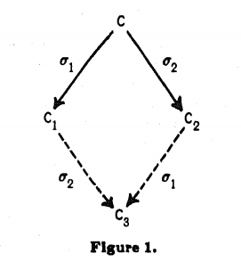
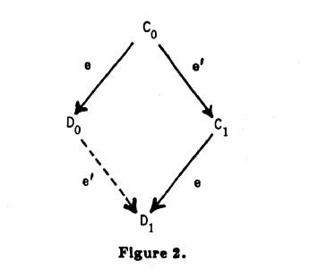
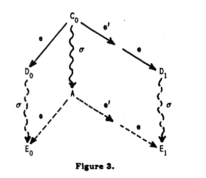

# FLP的证明

## FLP

**在网络可靠，但允许节点失效（即便只有一个）的最小化异步模型系统中，不存在一个可以解决一致性问题的确定性共识算法** 

### 分布式异步网络模型

1. 每个步骤的处理速度是未知的，可以很快，也可以很慢
2. 消息在进程之间的传递速度也是未知的
3. 进程内部或者之间，没有同步时间可以使用(这意味着没有办法使用超时等机制) 

### 一致性协议系统以及各种定义

* 一致性协议系统P由N个进程 (N>=2) 以及它们共有的一个消息队列组成，是一个异步系统。

* 每个进程p由输入{可以为0，1}，transition函数、输出{可以为b，0，1}组成。
  p取决于transition函数，**但是一旦进程到达decision状态，transition函数也无法改变这个结果**，因为输出register是一个**“一次性写入”**的。整个系统P是与每个进程的transition函数和输入register的初始值相关。

* 通信队列：存储已经发送，但是还没有被接收的消息，**不保证消息的投递顺序和速度**。
  如果消息的目标进程是正常的，保证最终可以将消息投递到对应的进程（可能投递/进程接收了很多次）

* 系统的configuration是由每个进程的内部状态和消息队列的内容组成,**configuration是一组进程的状态**

* 进程p处理消息m，记为“事件e”，e = (p, m)

* 一个step由一个原始的step组成，通过一个configuration转换成另一个step。一般分成两步：  

  1. 在消息队列中取出value  

  2. 根据configuration中进程p的内部状态，改变p的内部状态，然后将消息传给其他进程  
     run：一串step称为一个run，记为σ  
     σ(C)：代表状态C在进过σ后的状态  
     可到达状态: 若C1=σ(C0)，则称C0到C1是到可达(reachable)的  
     可访问状态: 将从初始状态可达的状态都称为可访问(accessible)的  
     进程正常：代表可以执行无限次的step(不断的从通信队列中获取消息，没有的话，就获取到空消息)，否则不正常。

* admissible run：在该run内，最多只有一个进程不正常工作，并且所有发送到正常工作进行的消息最终都被接收到了  
* deciding run：在该run内，有进程到达了决议状态(输出为确定值)  
* 确定的状态：如果某状态下，有进程的输出为决议值，则称该状态具有决议值    
* 部分正确的一致性协议：满足   
  a) 任何一个状态的决议值数量小于等于1；  
  b)对于任何一个0或者1的决议值v，都决议值为v的可访问状态。  
  ·完全正确的一致性协议:   
  a) 部分正确；  
  b) 每一个admissible run都是deciding run  
  ·令V为从C开始的所有可达状态的决定值的集合，则：  
          bivalent: V元素数量为2  
          univalent: V元素数量为1  
          0-valent: 在V元素数量为1的情况下，结论值为0，对应的状态称为0价的  
          1-valent: 与0-valent相对应  
  备注：根据“部分正确”的定义，可以推出，i-valent的状态及其之后所有的可达状态都是i-valent的

### 三条引理：

**1.Suppose that from some configuration C, the schedules σl, σ2 lead to configurations C1, C2, respectively. If the sets of processes taking steps in σ1 and σ2, respectively, are disjoint, then σ2 can be applied to Cl and σ1 can be applied to C2, and both lead to the same configuration C3.**  

即交换性

**2.P has a bivalent initial configuration.**  

采用反证法，基于部分正确的假设，那么P必然是0-valent或者1-valent。P的初始状态应该只是因为各个进程的输入不同而不同。因为consensus问题的第三条属性validity要求结果必须是某个结点提议的, 如果某个initial configuration中全体节点都是0, 那么结果一定是0, 不可能全体是0结果是1, 所以P的initial configurations全体为0和全体为1的两种情况必须产生0和1的结果, 也就是说必须同时包含0-valent和1-valent.

**通俗版**：
我们定义两个初始configuration是“**相邻的**”，如果他们只在一个进程上的状态不同。例如一个三进程的configuration，Cx={0,0,1}，Cy={1,0,1}，Cx和Cy只在p1上不同，那么Cx和Cy是相邻的。所有的初始configuration都可以通过一系列相邻的configuration连接起来（或者他们本身就是相邻的）。

现在考虑一个0-valent的初始configuration C0和一个1-valent的初始configuration C1。C0在变化到C1的过程中，必然可以找到两个相邻的初始configuration，他们的valent正好发生了变化。例如，我们有一个共识算法是基于多数（majority）的，C0={0,0,0}，C1={1,1,1}。那么C0到C1的变化可能是：

  C0   ->   Cx   ->   Cy   ->   C1  

{0,0,0} {0,0,1} {1,0,1} {1,1,1}

Cx和Cy是相邻的，且Cx是0-valent，Cy是1-valent。

取valent发生变化的两个相邻的configuration，C0和C1；令p是那个状态不同的进程。我们的共识算法必须要容忍进程p不可用的情况（论文的标题暗示的大前提）。

用上面的例子，Cx和Cy，当p0不可用时，{?,0,1}究竟是0-valent还是1-valent呢？如果是0-valent，那么Cy={1,0,1}在p0可用时是1-valent，在p0不可用时是0-valent，从而Cy是bivalent；如果{?,0,1}是1-valent，那么类似地Cx是bivalent。

于是我们导出了矛盾：在容忍一个进程不可用的前提下，假设不存在bivalent的初始configuration是不成立的。

**论文版**：
假设进程p是不正常工作的，那么C0就是一个admissible run，则任意一个步骤串σ，σ(C0)和σ(C1)应该只有p的内部状态不同，它们应该具有相同的决议值。如过该决议值为0，C1是bivalent的；若该决议值为1，则C0是bivalent的。与假设矛盾，假设不成立。

**3.Let C be a bivalent configuration of P, and let e = (p, m) be an event that is applicable to C. Let Cc be the set of configurations reachable from C without applying e, and let Dd = e(Cc) = {e(E) | E ∈ Cc and e is applicable to E}. Then, Dd contains a bivalent configuration.**

**论文版**：
采用反证法，假设Dd内的状态都是univalent，假设Ei是C的i-valent配置，即Ei ∈ Cc，那么Fi=e(Ei)∈Dd。我们将可以通过step转换的称为neighbors，如下图：

存在一个neighbors C1和C0 ∈ Cc，而Di=e(Ci)是属于i-valent的，那么C1=e'(C0)，即e'=(p',m')的。有两种可能：
1) 如果p' != p，那么根据交换律，e'(D0) = D1，矛盾
2) 如果p' == p，如下图所示，σ是一个不包含p的deciding run，因为σ是deciding run，所以σ(C0)是univalent；而从A又可达E0和E1，则说明A是bivalent，所以矛盾。

**通俗版**：
**令C是一个bivalent的初始configuration。e=(p,m)是一个可以应用到C的事件。X是不应用事件e到C的configuration的集合；Y是应用事件e到X的所有configuration的结果集合。那么Y包含一个bivalent的configuration。**

任何一个协议P一定会有bivalent初始configuration. 这是由于异步网络的本质造成的. 因为异步网络的消息顺序不一定, 所以对同一个初始configuration都可能会运行产生不同的结果. 

假设Y中不含有bivalent的configuration。

由于C是bivalent的，所以既可能存在0-valent的E0，也可能存在1-valent的E1。如果Ei（i=0或1，下同）存在于X，那么Fi=e(Ei)存在于Y（注意Y是e作用到X中所有configuration之后得到的结果configuration的集合）；如果Ei不存在于X，那么在到达Ei的过程中，取应用事件e之前的configuration Gi，Fi=e(Gi)存在于Y。如下图所示：

因此Y中同时存在0-valent和1-valent的configuration。

取Y中存在的0-valent的configuration Y0和1-valent configuration Y1；相应的取X中的configuration X0和X1使得e(X0)=Y0，e(X1)=Y1。类似引理2中的证明方法，我们知道0-valent的X0和1-valent的X1有一系列相邻的configuration相连。如图：

设e'=(p',m')是使Xa变换到Xb的事件。那么p和p'的关系有两种情况：

1. p != p'

根据引理1，Yb=e'(Ya)（如上图），所以Ya是bivalent的（无法确定自己将来是0-valent还是1-valent）。这和我们的假设“Y中不含有bivalent的configuration”矛盾。

2. p == p'

考虑p不可用的情况。从Xa开始，假设有事件序列S，使A=S(Xa)。根据引理1（注意S和e作用于不同的进程），S也可以应用于Ya。因此Za=S(e(Xa))=e(A)。同样，S也可以应用于Yb，导致Zb=S(e(e'(Xb)))=e(e'(A))。Za和Zb分别是0-valent和1-valent，都可以通过A变换而来，从而A是bivalent的。但Xa是univalent的，所以A=S(Xa)应该也是univalent。这就导出了矛盾。

由引理2，我们知道当一个进程不可用时就可能导致一个bivalent的初始configuration。
由引理3，我们知道从一个bivalent的configuration一定能达到另一个bivalent的configuration。因此这个循环可以一直进行下去，集群可能永远无法达成共识。

FLP论文从理论上证明了没有共识算法是一定正确的，能够容忍一个进程的不可用。但为什么仍然存在Paxos或Raft这样的共识算法呢？

首先，可能性的存在和实际发生的概率是独立的。现实中根据需要，我们可以接受一个在绝大多数情况下能达成共识的算法。

其次，最重要的是，FLP Impossibility是在异步模型上证明的；而异步模型并不完全适合我们的现实场景。回想异步模型的第二个特点：“没有时钟（clock）可用”，然而现实的系统中我们是可以做出“超时（timeout）”的判断的。例如Failure Detector的论文[Unreliable Failure Detectors for Reliable Distributed Systems](http://courses.csail.mit.edu/6.852/08/papers/CT96-JACM.pdf)在异步模型中增加超时的条件，可以达到确定性的对某个进程的存活状态达成共识。

### 定理

1. No consensus protocol is totally correct in spite of one fault.

按照之前说的，可以证明没有“partially correct”，来间接的证明没有“totally correct”。论文中是通过设想存在一个无限长，但却始终得不到决议值的run，来证明这一点。
假设有一个进程队列，初始时，队列中的进程是随机排列的，在执行一致性协议的过程中，当进程队列的排头进程p接收到消息并处理后，则将它排到进程队列的尾部。并且将这个时候，标记为一个旧阶段(Stage)的终结和一个新阶段的开始。这样所有的run都可以被分为这样的有限个或者无限个阶段了。
假设P的初始状态是bivalent的，根据引理3，可以推导出，对于每个阶段，都存在这样的步骤串，使得该阶段结束的状态仍然是bivalent的。从而使得这个一致性协议系统永远无法达到决议状态。

2. There is a partially correct consensus protocol in which all non-faulty processes always reach a decision, provided no processes die during its
  execution and a strict majority of the processes are alive initially.

论文中对这个定理的证明，是通过提供一个满足要求的协议算法来实现的。该协议分为两个阶段：
第一阶段：每个进程向其他进程广播自己进程编号，然后等待接收L-1个回应(L=((N+1)/2))（每个回应记为{i, j}，从i到j的回应）
第二阶段：每个进程在第一阶段后，向其他进程广播自己接收到的L-1个回应的信息。这个阶段，每个进程都会根据接收到的信息，建立传递闭包G+。对于每个接收进程来说，当它接收到所有知道的(包括第一阶段感知到的和第二阶段感知到的)其他进程在第二阶段广播的消息时，它的接收过程结束。
第二阶段结束后，每个进程都会得到一个G+，因为假设协议执行过程中是没有进程挂掉的，所以根据约束，各个进程在第二阶段结束后会得到相同的G+，然后在G+上确立一个“initial clique”，该“initial clique”的特征为：1) 没有任何来自该“initial clique”之外的其他节点的输入；2) 该initial clique的内每个节点也是它每个“祖先”节点的“祖先”。因为该“initial clique”元素数量至少大于L，所以G+内只存在一个这样的“initial clique”

依据假设可以得到，所有正常工作的进程最终都会完成第二阶段。每个完成第二阶段的进程，在确定的“initial clique”上，按照转换函数，确定输出值。因为所有正常工作进程上的“initial clique”都一样，所以，所有正常工作进程上的输出值也一样，一致性协议工作完成。

### FLP的通俗证明

Consensus定义:

1. termination: 所有进程最终会在有限步数中结束并选取一个值, 算法不会无尽执行下去.
2. agreement: 所有进程必须同意同一个值.
3. validity: 最终达成一致的值必须是V1到Vn其中一个, 如果所有初始值都是vx, 那么最终结果也必须是vx.

这里我们对于第二个条件, 我们弱化为只要有一个进程做出了决定即可.

首先, 排除Byzantine式故障. 消息系统是异步的, 但是任何消息都会被接收一次且仅一次, 并且无法伪造或者丢失. 这是比一般的异步网络更加可靠的一个网络模型. 这样收窄的一个模型如果不能有一个完全正确的consensus protocol, 那么一般的异步网络或者包含Byzantine故障的模型更不可能有正确的protocol. 完全正确(totally correct)是指同时满足safety和liveness. 在实际应用中, Paxos, Raft, PBFT都是保证safety但是不保证liveness的, 所以他们都不是完全正确的算法, 理论上存在进入无限循环的可能性(实际上概率非常低, 在工程中完全可以使用).

对于 **引理2**，它的本质就是：一个故障节点停止接受消息, 会使结果不确定。  

举个例子, 我们设计一个consensus算法, 规则如下: 有A/B/C三个节点, A作为leader对B/C做类似于两阶段提交的询问, A先告诉B/C期望的结果, B/C接受并返回应答, 只有收到应答之后A才能做出决定并发出第二个请求给B/C做提交, 如果A发生了故障, 那么B作为leader对C询问. 那么我们设计一个0-valent的C0和一个1-valent的C1分别如下：

C0=A建议0给B/C. B/C自己都倾向于1.

C1=A建议1给B/C. B/C自己都倾向于1.

明显, 如果没有任何故障, C0结果是0, C1结果是1. 因为C0和C1只差一个进程A不同, 假设A进程挂了, 那么C0’和C1’其实是一样的, 这时候他们俩结果应该是一致的, 应该都是1. 但是这和C0就算有一个故障节点也应该结果为0矛盾.

我们通过反证法证明了一个协议P必然包含bivalent initial configuraiton. 本质上这是异步网络中一个没有响应的节点导致的结果不确定性.

**引理3**

Let C be a bivalent configuration of P, and let e=(p, m) be an event that is applicable to C. Let Ɛ be the set of configurations reachable from C without applying e, and let Ɗ = e(Ɛ) = {e(E) when E∈Ɛ and e is applicable to E}. Then, Ɗ contains a bivalent configuration.

这是整个证明的核心部分, 这部分比较难理解. 首先C不是initial configuration了, C可能是某个中间过程的configuration, 然后C是bivalent的. 假设e=(p, m)这个消息是可以应用于C的, 那么不用e所能达到的所有configuration应该是一幅图. 这个图就是Ɛ. Ɛ内任何一个configuration再用e就跳出Ɛ, 并得到了一个集合Ɗ. 每一个’Ɛ边界’上的configuration就是E, 因而有D=e(E).

如果把e用于Ɛ中某一个configuration, 那么相当于Ɛ中离起始的C越远的configuration收到e越晚, e越被延迟. 由于我们定义了Ɛ不含e, 所以e只会发生在Ɛ的边界上, 实际上就是把e延迟成为离开Ɛ进入Ɗ的最后一个消息. e会把Ɛ内每一个configuration映射到Ɗ 中一个configuration.

我们要证明Ɗ包含bivalent configuration, 我们反证它. 假设D没有bivalent configuration, 那么Ɗ只能包含0-valent和1-valent. 也就是说e回把Ɛ中每一个边界的configuration变为(映射为)Ɗ 中的一个0-valent或者1-valent configuration. 按照这个思路, 因为C是bivalent, 所以一定会同时存在E0和E1分别是0-valent和1-valent. 接下来分两种情况分析:

如果E0还没有收到e, 那么E0属于Ɛ, 那么E0收到e之后会变成F0. F0明显是0-valent并且属于Ɗ. 同样, 如果E1还没有收到e, 也会有F1属于Ɗ.

如果E0已经收到过e, 那么E0不属于Ɛ, 由于e是最后一个消息, 所以必然存在于Ɛ边界上一个configuration收到e之后变成F0进入Ɗ, 然后F0可能经过收到其他消息最终变成E0. 根据反证假设, F0必须是0-valent. 类似的, 如果E1还没有收到e, 也会有F1属于Ɗ, 并且F1可以变成E1.

这两种情况下总是有一个E和F可以通过一个消息变成对方. 因为C是bivalent, 所以一定同时存在E0/E1, 那也就同时存在F0/F1. 所以由反证假设可以得出结论: Ɗ总是同时包含0-valent和1-valent.

那么我们按照这个假设, 我们从Ɛ中找两个configuration, C0和C1, 使得C0通过消息e’= (p’, m’)得到C1(此处C0和C1不表示他们是0-valent和1-valent, 0/1下标只是为了容易区分). 那么e能够把C0变成D0状态, e也可以把C1变成D1状态, 其中D0/D1是属于Ɗ 的0-valent和1-valent. 如下图所示:

接下来我们又要分两种情况讨论. 第一种比较简单, 如果e’和e所接受消息的p’和p不同, 那么从C0开始, e’和e所作用的进程是离散不相交的, 根据引理1, C0上用了e再用e’和先用e’再用e的结果应该是一样的. 根据引理1, 我们把这个图稍微旋转一下, 会看到这样一幅图.

红色是根据引理1加上去的, 但是这条红色的会把一个0-valent的D0变成1-valent的D1, 这是明显矛盾不可能的. 所以第一种情况不存在.

再看第二种情况, 假设p’和p相同. 这种情况更复杂一点. 任何一个从C0开始不含p的消息(p不工作)的有限步数的deciding run会得到一个0-valent或者1-valent的configuration A, 我们把这个deciding run的事件序列标记为𝞂. 因为𝞂不含p的事件, 所以它和e作用的进程不相交, 那么用引理1可以得出下图中的E0. 同理, e’和e都作用于p, 所以e’和e的事件序列和𝞂作用的进程也不想交, 根据引理1可以得到E1.

那么我们可以看出A可以变成E0也可以变成E1, 这说明A是bivalent的. 但是这和A是一个deciding run的结果矛盾. (A要么0-valent要么1-valent).

至此p=p’和p!=p’的两种情况在我们的反证假设下都矛盾, 因此反证假设错误. 引理3 证明完成, 即: Ɗ 一定包含bivalent configuration.

定理：

No Consensus protocol is totally correct in spite of one fault.

根据Lemma 2, P一定含有bivalent initial configuration, 那么任何从这个bivalent状态进入univalent的deciding run, 其中必然存在一个从bivalent到univalent的关键步骤, 这个步骤决定了最终结果. 我们接下来就是要证明系统中总是有可能会把这个步骤无限推迟下去.

我们设计一个队列, 把所有进程放到这个队列中, 按照FIFO的顺序每次一个进程出来, 这个进程从message buffer取出第一个此进程的消息, 把计算后发给其他进程的消息放回message buffer尾部, 然后进程自己回到队列尾部等待下一轮调度. 这个模型保证了每个进程总是有机会获得发送给他的消息. 根据Lemma 2我们知道y一定会存在一个bivalent的configuration C0, 从C0开始执行到某一个bivalent的C, 这时候message buffer中第一个C的消息是e. 再根据Lemma 3我们知道如果把e挪到message buffer后面延迟这个消息的送达, 那么C一定会再产生一个bivalent configuration C’进入Ɗ. 这意味着通过延迟e, 可以让一个bivalent configuration再产生一个bivalent configuraiton, 因为可能会永远无法达到一个univalent configuration, 也就永远无法产生结果.

**Safety Properties**, 在程序运行中不会进入非预期的状态(如非法调用参数, 数组下标越界等运行错误).
**Liveness Properties**, 在程序运行中预期状态一定会到达(如停机, 获取资源请求一定有返回结果等等).

FLP论证了在一个异步的分布式系统中，即是只是容忍一个进程的错误，也不存在一个一致性算法可以保证正确性。
首先FLP的前提是建立在一个完全异步的不可靠环境假设下，实际上可以让系统稍微“可靠”一些，其次，它只是论证了即使仅仅要容忍一个进程的错误，一致性算法都存在着永远不结束的可能。

通俗讲FLP告诉你异步网络中liveness和safety是一对冤家. total correct意味着要safety, 那么对不起, liveness不保证了. 这其实蕴含了CAP, 只是CAP太宽泛缺乏模型, 而FLP的模型严谨因为只针对concensus问题. CAP比较宽泛, 不仅是consensus问题. FLP是一个收窄的模型(fail-stop模型, 消息传递一次且仅一次, 不会丢失, 有一个节点进入decision state就算结束), 所以FLP的证明更有杀伤力. FLP最大的作用就是告诉我们要放松liveness, 因此Paxos/Raft才能认为是可行的, 严格讲Paxos可能永远无法结束, 另外有一点很多人没有注意到, FLP的论文提出的0-1 consensus问题成为了以后很多问题的研究模型.